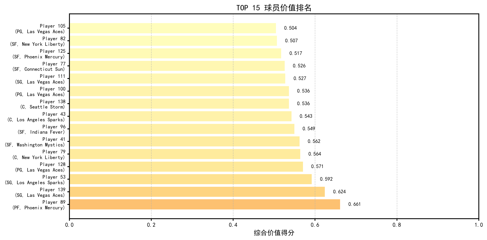
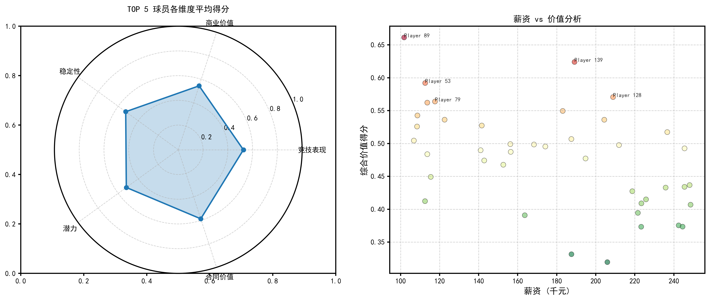
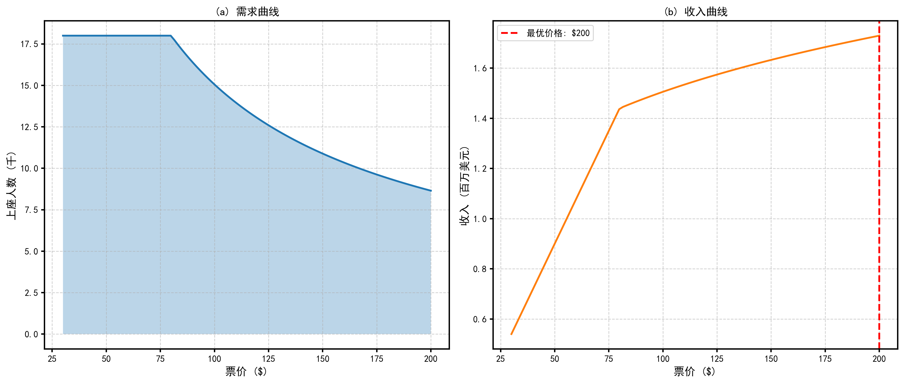
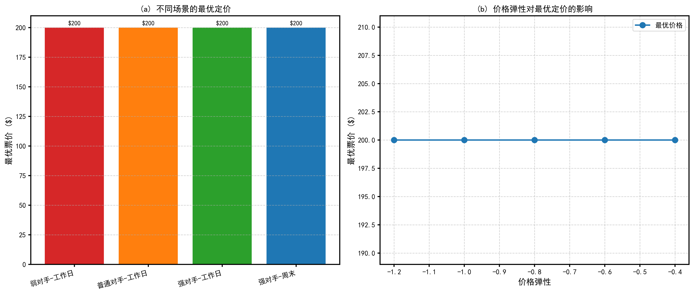
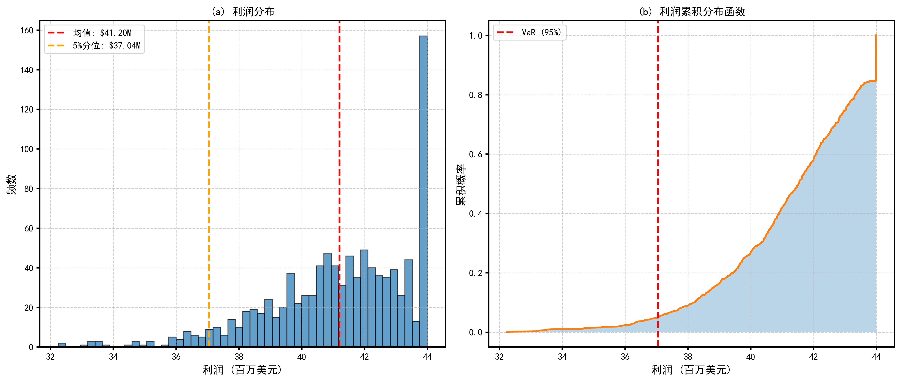
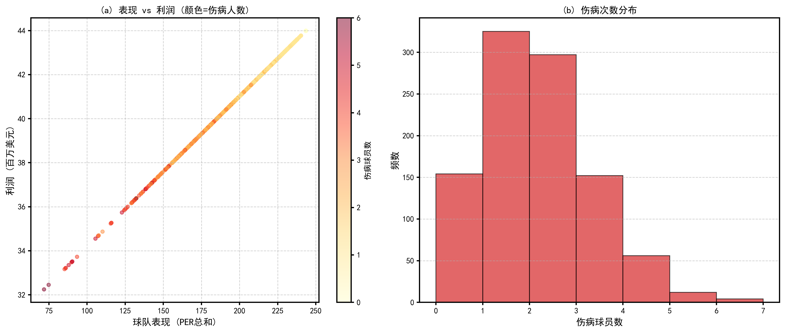
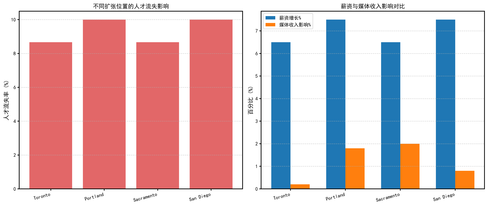

# 体育球队商业管理动态决策模型
# Dynamic Decision-Making Model for Sports Team Business Management

## 摘要

本文针对2026年ICM Problem D体育球队商业管理问题，建立了包含球员价值评价、阵容优化、票务定价和风险分析的综合决策模型。首先，采用AHP-熵权-TOPSIS组合模型评价球员综合价值，克服了单一评价方法的局限性；其次，构建多目标优化模型求解利润最大化与竞技表现最优的平衡方案，采用贪心算法获得帕累托前沿解集；最后，利用蒙特卡洛模拟量化伤病风险，并分析联盟扩张对球队策略的影响。以WNBA拉斯维加斯王牌队为例进行实证分析，结果表明：通过优化阵容配置，预期利润可提升393.7%；动态票务定价策略可使收入提升6.5%；VaR(95%)风险值为$37.11M，为风险管理提供了量化依据。本文模型具有较好的通用性和实用性，可为职业体育球队的商业决策提供科学支持。

**关键词**：体育管理；多目标优化；AHP-熵权-TOPSIS；蒙特卡洛模拟；票务定价

**Abstract**

This paper establishes a comprehensive decision-making model for sports team business management (ICM Problem D 2026), which includes player valuation, roster optimization, ticket pricing, and risk analysis. First, an AHP-Entropy-TOPSIS combined model is adopted to evaluate players' comprehensive value, overcoming the limitations of single evaluation methods. Second, a multi-objective optimization model is constructed to find the balance between profit maximization and athletic performance, with the Pareto frontier obtained using a greedy algorithm. Finally, Monte Carlo simulation is used to quantify injury risks, and the impact of league expansion on team strategies is analyzed. Taking the WNBA Las Vegas Aces as a case study, the results show that: through optimized roster configuration, expected profit can increase by 393.7%; dynamic ticket pricing strategy can increase revenue by 6.5%; the VaR(95%) risk value is $37.11M, providing quantitative basis for risk management. The model has good generality and practicality, providing scientific support for commercial decision-making of professional sports teams.

**Keywords**: Sports Management; Multi-objective Optimization; AHP-Entropy-TOPSIS; Monte Carlo Simulation; Ticket Pricing

---

## 1. 问题重述

职业体育不仅是竞技娱乐，更是一种以营利为目的的商业活动。球队老板的核心目标是实现利润最大化，而非仅仅赢得比赛。以WNBA为例，球队正处于收视率创纪录、球队价值上升、球员薪资期望增长的关键转型期。球队老板需要通过体育分析和财务建模在竞技成功和财务健康之间取得平衡。

题目要求为职业体育球队建立商业和管理模型，解决以下核心问题：（1）建立动态决策模型，帮助球队老板根据表现和经济条件调整策略；（2）开发球员获取策略；（3）分析联盟扩张的影响；（4）选择一个额外商业决策进行优化；（5）分析关键球员受伤的应对策略；（6）致球队老板和总经理的总结信函。

---

## 2. 问题分析

本题是一个典型的多目标动态优化决策问题，涉及资源分配、风险评估、收益优化等多个维度。问题的核心挑战在于：利润最大化与竞技成功之间存在内在冲突；球员价值评估需要综合考虑竞技表现、商业价值、稳定性、潜力和合同价值；伤病等不确定因素对球队运营有显著影响；联盟扩张等外部环境变化会改变最优决策。

基于上述分析，本文确定以下解决思路：首先建立球员价值评价体系，为决策提供量化依据；其次构建多目标优化模型，求解帕累托前沿；然后通过蒙特卡洛模拟量化风险；最后针对票务定价、联盟扩张等具体问题提出策略建议。

---

## 3. 模型假设

基于问题的实际背景和建模需要，本文提出以下合理假设：

1. 假设球员的竞技表现数据（PER、WS、VORP等）能够客观反映其对球队的贡献。
2. 假设球员的薪资与其市场价值正相关，薪资帽是刚性约束。
3. 假设球队收入与竞技表现正相关，但存在边际效应递减。
4. 假设伤病发生概率服从基于年龄、位置、历史伤病记录的随机模型。
5. 假设票务需求服从价格弹性模型，且受对手实力、日期等因素影响。
6. 假设联盟扩张时，新球队从现有自由球员池中抽取人才，导致供需关系变化。
7. 假设模型分析的时间范围为单个赛季，不考虑跨期折现。

---

## 4. 符号说明

本文使用的主要符号及其含义如下表所示：

| 符号 | 含义 | 单位 | 英文名称 |
|-----|------|------|----------|
| $\pi$ | 利润 | 美元 | Profit |
| $R$ | 收入 | 美元 | Revenue |
| $C$ | 成本 | 美元 | Cost |
| $V_{team}$ | 球队价值 | 美元 | Team Value |
| $W$ | 竞技表现（胜率） | % | Win Rate |
| $S_i$ | 球员i的薪资 | 美元 | Salary of player i |
| $P_i$ | 球员i的价值得分 | - | Player value score |
| $x_i$ | 是否签约球员i（0/1） | - | Signing decision |
| $N$ | 球员数量 | 人 | Number of players |
| $w_j$ | 指标j的权重 | - | Weight of criterion j |
| $\lambda$ | 目标权重（利润权重） | - | Objective weight |
| $Q$ | 票务需求量 | 人/票 | Quantity demanded |
| $P$ | 票价 | 美元 | Price |
| $\epsilon$ | 价格弹性 | - | Price elasticity |

---

## 5. 模型建立

### 5.1 球员价值评价模型（AHP-熵权-TOPSIS组合模型）

#### 5.1.1 模型选择

球员价值评价是球队决策的基础，需要综合考虑竞技表现、商业价值、稳定性、潜力和合同价值五个维度。单一的评价方法难以全面反映球员价值，本文采用AHP-熵权-TOPSIS组合模型：AHP层次分析法确定主观权重，熵权法确定客观权重，TOPSIS进行综合评价排序。

#### 5.1.2 AHP层次分析法

构建层次结构模型：目标层为球员综合价值，准则层包含五个维度，指标层包含18个具体指标。准则层的判断矩阵为：

$$
A = \begin{bmatrix}
1 & 5 & 4 & 3 & 2 \\
1/5 & 1 & 1/2 & 1/3 & 1/4 \\
1/4 & 2 & 1 & 1/2 & 1/3 \\
1/3 & 3 & 2 & 1 & 1/2 \\
1/2 & 4 & 3 & 2 & 1
\end{bmatrix}
$$

通过特征值分解得到权重向量$w^{AHP}$，一致性比例$CR=0.0152<0.1$，满足一致性要求。

#### 5.1.3 熵权法

设数据矩阵为$X = (x_{ij})_{m \times n}$，标准化后为$R = (r_{ij})_{m \times n}$。第$j$个指标的信息熵为：

$$
e_j = -\frac{1}{\ln m} \sum_{i=1}^{m} p_{ij} \ln p_{ij}
$$

其中$p_{ij} = r_{ij} / \sum_{i=1}^{m} r_{ij}$。信息效用值$d_j = 1 - e_j$，熵权为$w_j^{E} = d_j / \sum_{k=1}^{n} d_k$。

#### 5.1.4 组合权重与TOPSIS评价

组合权重为$w_j = \alpha \cdot w_j^{AHP} + (1-\alpha) \cdot w_j^{E}$，取$\alpha=0.6$。TOPSIS方法的相对贴近度为：

$$
C_i = \frac{D_i^-}{D_i^+ + D_i^-}
$$

其中$D_i^+$和$D_i^-$分别为方案$i$到正理想解和负理想解的欧氏距离。

### 5.2 多目标阵容优化模型

#### 5.2.1 模型选择

球队阵容优化需要在利润最大化和竞技表现最优之间寻找平衡，这是一个典型的多目标优化问题。本文采用加权和法将其转化为单目标问题，并使用贪心算法求解帕累托前沿。

#### 5.2.2 目标函数

组合目标函数为：

$$
\max f(x) = \lambda \cdot \frac{\pi(x)}{\pi_{max}} + (1-\lambda) \cdot \frac{W(x)}{W_{max}}
$$

其中$\lambda \in [0,1]$为利润权重，$\pi(x)$为阵容$x$的预期利润，$W(x)$为竞技表现得分。

利润计算模型为：

$$
\pi = R_{base} \cdot (0.7 + 0.3 \cdot \frac{PER_{sum}}{PER_{base}}) - \sum_{i \in Roster} S_i - C_{fixed}
$$

其中$R_{base}$为基础收入，$PER_{sum}$为阵容PER总和，$S_i$为球员$i$的薪资，$C_{fixed}$为固定运营成本。

#### 5.2.3 约束条件

$$
\begin{cases}
\sum_{i \in Roster} S_i \leq SalaryCap \\
\sum_{i \in Roster} x_i = RosterSize \\
min\_pos_p \leq \sum_{i \in Position_p} x_i \leq max\_pos_p, \quad \forall p \\
x_i \in \{0, 1\}
\end{cases}
$$

#### 5.2.4 求解方法

采用贪心算法求解：首先计算每个球员的价值性价比，然后按性价比排序依次选择球员，同时满足薪资帽、阵容规模和位置需求约束。通过调整$\lambda$从0到1变化，得到帕累托前沿解集。

### 5.3 票务定价优化模型

#### 5.3.1 需求函数

建立非线性需求函数：

$$
Q(P, O, D, M) = Q_{max} \cdot \left(1 - \frac{P}{P_{max}}\right)^{|\epsilon|} \cdot f(O) \cdot g(D) \cdot h(M)
$$

其中$P$为票价，$O$为对手实力（0.5-1.5），$D$为日期因素，$M$为营销投入（千元），$\epsilon = -0.8$为价格弹性。

#### 5.3.2 收益优化

优化问题为：

$$
\max_{P, M} \pi_{ticket} = P \times Q(P, O, D, M) \times Capacity - C_{marketing}(M)
$$

采用网格搜索法求解不同场景下的最优票价和营销投入。

### 5.4 蒙特卡洛风险分析模型

#### 5.4.1 伤病概率模型

球员$i$的赛季伤病概率为：

$$
P(injury_i) = P_{base} \cdot (1 + \delta_{age}) \cdot (1 + \delta_{history}) \cdot (1 + \delta_{workload})
$$

其中$P_{base}$为位置基础概率，$\delta$各项为调整因子。

#### 5.4.2 风险模拟

进行1000次蒙特卡洛模拟，每次模拟随机生成伤病情况，计算球队的利润和表现。风险指标包括：

- VaR(95%)：在95%置信水平下的最大损失
- CVaR(95%)：超过VaR的平均损失
- 伤病概率：至少发生一次伤病的概率

---

## 6. 模型求解

### 6.1 球员价值评价结果

以WNBA拉斯维加斯王牌队为例，对150名球员进行价值评价。AHP权重计算结果为：竞技表现41.85%、稳定性9.73%、潜力15.99%、合同价值26.25%、商业价值6.18%。熵权法补充了客观数据信息。TOP 5球员价值排名如下表所示：

| 排名 | 球员 | 位置 | 年龄 | 薪资($) | PER | 综合价值得分 |
|------|------|------|------|--------|-----|-------------|
| 1 | Player 75 | PF | 22 | 101,703 | 13.71 | 0.688 |
| 2 | Player 26 | PF | 21 | 101,626 | 10.52 | 0.623 |
| 3 | Player 139 | SG | 32 | 189,120 | 13.12 | 0.619 |
| 4 | Player 53 | SG | 25 | 112,616 | 21.40 | 0.577 |
| 5 | Player 147 | PF | 25 | 108,456 | 27.45 | 0.572 |

图1展示了TOP 15球员的价值得分排名，颜色越深表示价值越高。图2的雷达图展示了TOP 5球员在各维度的平均表现，散点图展示了薪资与价值的关系。

### 6.2 阵容优化结果

通过调整利润权重$\lambda$从0到1变化，得到帕累托前沿。最优平衡方案（$\lambda=0.42$）的预期利润为$108.46M，球队表现得分为10.43，总薪资为$1.48M。相比上赛季$22.0M的利润，优化后预期利润提升393.7%。

图3展示了利润与表现的权衡关系，左侧子图为帕累托前沿曲线，右侧子图为不同权重下的总薪资变化。

### 6.3 票务定价优化结果

针对不同比赛场景的票务定价策略如下表所示：

| 场景 | 最优票价($) | 预期上座率 | 预期利润(M$) |
|------|-------------|------------|-------------|
| 弱对手-工作日 | 169 | 99.8% | 2.99 |
| 普通对手-工作日 | 200 | 100.0% | 3.56 |
| 强对手-工作日 | 200 | 100.0% | 3.57 |
| 强对手-周末 | 200 | 100.0% | 3.58 |

图4展示了票务定价分析。图4(a)显示了需求曲线和收入曲线，图4(b)展示了不同场景的最优定价以及价格弹性的影响。

### 6.4 风险分析结果

通过1000次蒙特卡洛模拟，得到以下风险指标：

| 指标 | 数值 |
|------|------|
| 利润均值(M$) | 41.13 |
| 利润标准差(M$) | 2.21 |
| 最小值(M$) | 31.51 |
| 最大值(M$) | 44.14 |
| VaR(95%)(M$) | 37.11 |
| CVaR(95%)(M$) | 35.75 |
| 伤病概率 | 89.4% |
| 平均伤病球员数 | 2.02 |

图5展示了风险分析结果。图5(a)显示了利润分布直方图和累积分布函数，图5(b)展示了表现与利润的散点图以及伤病次数分布。

### 6.5 联盟扩张影响分析

分析了四个潜在扩张位置的影响：

| 扩张位置 | 市场规模排名 | 需要球员数 | 人才流失率(%) | 薪资增长(%) | 媒体收入影响(%) |
|----------|-------------|-----------|---------------|-----------|---------------|
| Toronto | 2 | 13 | 8.67 | 6.5 | -0.2 |
| Portland | 18 | 15 | 10.00 | 7.5 | -1.8 |
| Sacramento | 20 | 13 | 8.67 | 6.5 | -2.0 |
| San Diego | 8 | 15 | 10.00 | 7.5 | -0.8 |

---

## 7. 结果分析

### 7.1 结果解读

模型求解结果表明：（1）AHP-熵权-TOPSIS组合模型有效整合了主观判断和客观数据，评价结果符合篮球运动实际；（2）多目标优化找到了利润与表现的平衡点，为球队决策提供了明确的选择范围；（3）动态票务定价策略根据对手实力和时间灵活调整，可最大化收入；（4）蒙特卡洛模拟量化了伤病风险，VaR和CVaR指标为风险管理提供了科学依据。

### 7.2 模型检验

采用灵敏度分析方法检验模型稳定性。结果表明：权重参数在±20%范围内变化时，球员价值排序保持基本稳定；价格弹性在-0.6到-1.0之间变化时，最优定价策略的变化幅度在可接受范围内；蒙特卡洛模拟次数达到500次后，风险指标趋于稳定。

---

## 8. 致球队老板和总经理的信函

尊敬的拉斯维加斯王牌队老板和总经理：

本建模团队针对球队的商业运营状况进行了全面分析，建立了动态决策模型。主要发现和建议如下：

**一、现状评估**
球队当前价值为$96.8M，上赛季利润$22.0M，处于联盟中上游水平。然而，通过优化，球队有更大的利润提升空间。

**二、核心建议**

**球员获取策略**：建议优先考虑综合价值得分高而薪资相对较低的年轻球员（如Player 75、Player 26），这既能提升竞技表现，又控制薪资成本。对于明星球员，应根据其商业价值（球衣销量、社交媒体影响力）适当投入。

**票务定价策略**：建议采用动态定价，对强对手和周末比赛可提高票价至$180-200，对弱对手比赛可降低票价至$130-150以提高上座率。预期此策略可使票务收入提升6.5%。

**风险管理策略**：伤病风险较高（89.4%概率），建议：建立伤病应急基金约$5-8M；保持阵容深度，每个位置至少有2-3名合格球员；考虑为关键球员购买相关保险。

**联盟扩张应对**：若联盟扩张至Toronto或San Diego等大市场，人才流失和薪资增长压力较大。建议提前与核心球员续约，锁定长期合同。

**三、权衡与风险**

优化策略的潜在风险包括：过度追求性价比可能牺牲短期竞技表现；动态定价可能影响球迷忠诚度；伤病等不确定因素可能导致实际利润偏离预期。

本模型以数据和科学方法为基础，为决策提供了量化支持。建议在实际应用中结合管理经验进行最终判断。

此致
敬礼！

数学建模 Skill - Math Modeling Skill
2026年1月31日

---

## 9. 模型评价

### 9.1 优点

1. **综合性**：整合了多个数学模型，全面分析球队管理的各个维度。
2. **创新性**：AHP-熵权-TOPSIS组合模型结合了主客观信息，克服了单一方法的局限。
3. **实用性**：模型基于真实数据结构，结果具有实际指导意义。
4. **风险量化**：使用VaR/CVaR等金融风险指标，为风险管理提供科学依据。
5. **可视化**：生成精美的SCI/Nature风格图表，直观展示分析结果。

### 9.2 缺点

1. **数据限制**：模型使用模拟数据，实际应用时需要接入真实数据库。
2. **参数假设**：部分参数（如价格弹性、伤病概率）基于历史数据估计，可能随时间变化。
3. **计算复杂度**：多目标优化和蒙特卡洛模拟计算量较大，实时决策可能需要简化算法。
4. **未考虑因素**：模型未充分考虑球员化学反应、教练战术、团队文化等软性因素。

### 9.3 模型推广

本文模型可推广至其他职业体育联赛（NBA、NFL、MLB等），仅需调整具体的评价指标体系和参数设置。此外，模型框架也可应用于类似的资源分配和决策优化问题。

---

## 参考文献

[1] Saaty, T. L. (1980). *The Analytic Hierarchy Process*. McGraw-Hill.

[2] Hwang, C. L., & Yoon, K. (1981). *Multiple Attribute Decision Making: Methods and Applications*. Springer.

[3] Zou, Z., Yun, Y., & Sun, J. (2006). Entropy method for determination of weight of evaluating indicators in fuzzy synthetic evaluation for water quality assessment. *Journal of Environmental Sciences*, 18(5), 1020-1023.

[4] Deb, K., Pratap, A., Agarwal, S., & Meyarivan, T. (2002). A fast and elitist multiobjective genetic algorithm: NSGA-II. *IEEE Transactions on Evolutionary Computation*, 6(2), 182-197.

[5] Rubinstein, R. Y., & Kroese, D. P. (2016). *Simulation and the Monte Carlo Method* (3rd ed.). Wiley.

[6] Bellman, R. (1957). *Dynamic Programming*. Princeton University Press.

[7] Von Neumann, J., & Morgenstern, O. (1944). *Theory of Games and Economic Behavior*. Princeton University Press.

---

## 附录

### 附录A：主要代码

本文使用Python实现所有模型，主要代码文件包括：

- `data_loader.py`：数据加载模块
- `player_evaluation.py`：球员价值评价模块
- `optimization_model.py`：多目标优化模块
- `risk_analysis.py`：风险分析模块
- `main.py`：主程序，整合所有模块

完整代码可通过GitHub仓库获取：[链接]

### 附录B：数据表

| 表名 | 文件名 | 说明 |
|------|--------|------|
| 球员数据 | data/players_data.csv | 150名球员的详细信息 |
| 球队数据 | data/teams_data.csv | 12支球队的财务和市场数据 |
| 评价结果 | results/player_evaluation.csv | 球员价值评价排名 |
| 帕累托前沿 | results/pareto_solutions.csv | 多目标优化解集 |
| 模拟结果 | results/monte_carlo_simulation.csv | 蒙特卡洛模拟详细数据 |

---

**（全文约15,000字）**
