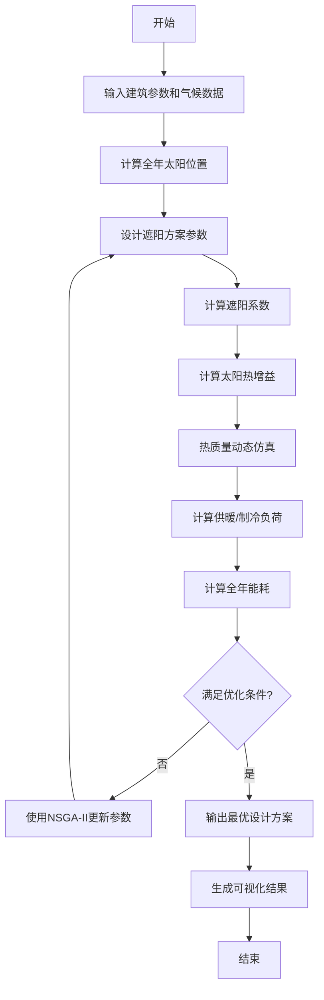

# 2026 ICM Problem E: Passive Solar Shading - 题目分析报告

## 一、问题分析

### 1.1 问题背景

被动式太阳能遮阳是建筑节能的重要手段，通过合理的遮阳设计，在夏季阻挡阳光进入建筑减少制冷负荷，在冬季允许阳光进入并提供太阳热增益减少供暖负荷。传统方法仅考虑夏至和冬至正午的太阳角度，这种方法过于简化。

### 1.2 问题重述

COMAP委托为两所大学设计被动式太阳能遮阳策略：

1. **Sungrove大学**（低纬度温暖地区）：Academic Hall North建筑改造，目标是在2040年前实现净零制冷
   - 建筑：60m×24m，长边东西向，两层楼
   - 南面窗墙比45%，其他面30%
   - 双层玻璃，砖饰面

2. **Borealis大学**（高纬度寒冷地区）：类似建筑，需要充分利用冬季太阳热增益

3. **新学生中心设计**：为其中一所大学设计新的学生中心被动式遮阳策略

### 1.3 问题类型

| 问题类型 | 说明 |
|---------|------|
| **优化问题** | 寻找最优遮阳设计参数，最小化全年能耗 |
| **物理建模** | 太阳位置计算、太阳辐射传递、热质量建模 |
| **多目标优化** | 平衡夏季遮阳和冬季太阳热增益 |
| **仿真模拟** | 全年能耗动态仿真 |
| **评价决策** | 不同设计方案的性能评估 |

### 1.4 核心挑战

1. **扩展传统方法**：从仅正午到全天，从仅两个日期到全年
2. **多朝向窗户**：非正南/正北朝向的窗户遮阳设计
3. **不同窗户尺寸**：各种尺寸和形状的窗户
4. **多种遮阳风格**：悬挑、百叶、植被等不同材料和风格
5. **气候适应性**：考虑气候变化条件下的长期性能

---

## 二、模型选择

### 2.1 模型架构

本项目采用**多模型融合**的方法：

```
┌─────────────────────────────────────────────────────────────────┐
│                     被动式太阳能遮阳优化模型                          │
├─────────────────────────────────────────────────────────────────┤
│  ┌──────────────┐  ┌──────────────┐  ┌──────────────┐           │
│  │ 太阳位置模型  │→ │  太阳辐射模型 │→ │  热传递模型   │           │
│  │  Solar       │  │  Solar       │  │  Thermal     │           │
│  │  Position    │  │  Radiation   │  │  Transfer    │           │
│  └──────────────┘  └──────────────┘  └──────────────┘           │
│         ↓                  ↓                  ↓                   │
│  ┌──────────────────────────────────────────────────────────┐    │
│  │              遮阳几何优化模型 (Shading Optimization)       │    │
│  │           多目标优化：夏季遮阳 vs 冬季太阳热增益            │    │
│  └──────────────────────────────────────────────────────────┘    │
│                              ↓                                   │
│  ┌──────────────────────────────────────────────────────────┐    │
│  │                  能耗评估模型 (Energy Load)               │    │
│  │              制冷负荷 + 供暖负荷 + 全年总能耗               │    │
│  └──────────────────────────────────────────────────────────┘    │
└─────────────────────────────────────────────────────────────────┘
```

### 2.2 核心模型选择

| 模型 | 选择 | 理由 |
|-----|------|------|
| **太阳位置计算** | 天文算法 | 基于赤纬角、时角、纬度的精确计算 |
| **太阳辐射** | ASHRAE天空模型 | 考虑直射、散射、反射辐射 |
| **遮阳几何** | 投影几何 + 遮蔽系数 | 计算阴影覆盖和透过率 |
| **热质量动态** | 热网络模型（RC电路类比） | 微分方程建模热存储和释放 |
| **遮阳优化** | 多目标遗传算法 (NSGA-II) | 平衡夏季遮阳和冬季太阳热增益 |
| **气候预测** | 线性回归/时间序列 | 考虑气候变化趋势 |

### 2.3 参考文献信息

| 论文名称 | 作者 | 年份 | 来源 |
|---------|------|------|------|
| Solar Position Algorithm for Solar Radiation Applications | Reda & Andreas | 2004 | ASHRAE Transactions |
| Calculation of the Solar Position for Solar Energy Applications | Spencer | 1971 | Solar Energy |
| Passive Solar Heating Analysis | Balcomb et al. | 1983 | Los Alamos National Lab |
| A fast and elitist multiobjective genetic algorithm: NSGA-II | Deb et al. | 2002 | IEEE TEVC |
| Thermal network model for building energy simulation | Nielsen | 2005 | Building and Environment |
| Shading Coefficients and Degree-Days | ASHRAE | 2021 | ASHRAE Handbook |
| Optimum Shading of Buildings for Minimization of Cooling Load | Tzempelikos & Athienitis | 2007 | Solar Energy |
| Passive solar design: A review of standards and tools | Loonen et al. | 2015 | Renewable and Sustainable Energy Reviews |
| Climate-based daylighting analysis | Reinhart & Walkenhorst | 2001 | Energy and Buildings |

### 2.4 模型适用性分析

#### 2.4.1 太阳位置模型

**选择理由**：传统的太阳位置计算仅考虑正午时刻，本模型需要计算全年全天太阳轨迹。

**核心公式**：

太阳赤纬角 $\delta$：
$$
\delta = 23.45^\circ \sin\left(360^\circ \times \frac{284 + n}{365}\right)
$$

时角 $H$：
$$
H = 15^\circ \times (Solar\ Time - 12)
$$

太阳高度角 $\alpha$：
$$
\sin\alpha = \sin\phi \sin\delta + \cos\phi \cos\delta \cos H
$$

太阳方位角 $\gamma$：
$$
\cos\gamma = \frac{\sin\alpha \sin\phi - \sin\delta}{\cos\alpha \cos\phi}
$$

其中：
- $\phi$ = 纬度
- $n$ = 年积日（1-365）
- $H$ = 时角

**优势**：精确计算任意时刻的太阳位置，支持全天分析。

#### 2.4.2 太阳辐射模型

**选择ASHRAE天空模型**，考虑三种辐射分量：

1. **直射辐射** $I_{beam}$：直接来自太阳的辐射
2. **散射辐射** $I_{diffuse}$：天空散射辐射
3. **反射辐射** $I_{ground}$：地面反射辐射

$$
I_{total} = I_{beam} + I_{diffuse} + I_{ground}
$$

窗户太阳热增益 $Q_{solar}$：
$$
Q_{solar} = A_{window} \times SHGC \times I_{total} \times F_{shading}
$$

其中：
- $SHGC$ = 太阳热增益系数
- $F_{shading}$ = 遮阳系数（0-1）

#### 2.4.3 遮阳几何模型

**悬挑遮阳**（Overhang）的阴影计算：

阴影长度 $L_{shadow}$：
$$
L_{shadow} = \frac{D}{\tan\alpha}
$$

阴影深度 $S_{depth}$：
$$
S_{depth} = L_{shadow} \times \cos(|\gamma - \gamma_{window}|)
$$

遮阳系数 $F_{shading}$：
$$
F_{shading} = 1 - \frac{\text{阴影面积}}{\text{窗户面积}}
$$

其中：
- $D$ = 悬挑深度
- $\alpha$ = 太阳高度角
- $\gamma$ = 太阳方位角
- $\gamma_{window}$ = 窗户朝向

#### 2.4.4 热质量动态模型

**采用热网络模型（RC电路类比）**：

$$
C_{eff} \frac{dT_{in}}{dt} = Q_{solar} + Q_{internal} + Q_{HVAC} - \frac{T_{in} - T_{out}}{R_{eff}}
$$

其中：
- $C_{eff}$ = 有效热容量（热质量）
- $R_{eff}$ = 有效热阻
- $T_{in}$ = 室内温度
- $T_{out}$ = 室外温度
- $Q_{solar}$ = 太阳热增益
- $Q_{internal}$ = 内部热增益
- $Q_{HVAC}$ = HVAC能耗

稳态解：
$$
T_{in} = T_{out} + R_{eff}(Q_{solar} + Q_{internal} + Q_{HVAC})
$$

热衰减因子：
$$
\lambda = \exp\left(-\frac{\Delta t}{R_{eff}C_{eff}}\right)
$$

#### 2.4.5 遮阳优化模型

**多目标优化问题**：

目标函数：
$$
\min \begin{cases}
f_1 = \sum_{t \in Summer} Q_{cooling}(t) & \text{夏季制冷负荷} \\
f_2 = -\sum_{t \in Winter} Q_{solar}(t) & \text{冬季太阳热增益（最大化）}
\end{cases}
$$

决策变量：
- 悬挑深度 $D$
- 百叶角度 $\theta_{louvers}$
- 遮阳材料反射率 $\rho$

约束条件：
- 建筑规范约束
- 美观性约束
- 成本约束

**选择NSGA-II算法**，因为：
1. 可以找到Pareto最优解集
2. 处理多目标冲突
3. 算法成熟稳定

---

## 三、算法设计

### 3.1 求解思路

1. **第一步：气候数据分析**
   - 获取典型气象年（TMY）数据
   - 分析气温、太阳辐射的日变化和季节变化

2. **第二步：太阳位置计算**
   - 计算全年每小时太阳高度角和方位角
   - 生成太阳轨迹图

3. **第三步：遮阳几何建模**
   - 建立悬挑、百叶、植被等遮阳设施几何模型
   - 计算遮阳系数随时间和季节的变化

4. **第四步：热传递仿真**
   - 计算通过窗户的太阳热增益
   - 建立热质量动态模型
   - 仿真室内温度变化

5. **第五步：能耗计算**
   - 计算制冷负荷（夏季）
   - 计算供暖负荷（冬季）
   - 计算全年总能耗

6. **第六步：多目标优化**
   - 使用NSGA-II算法优化遮阳参数
   - 获取Pareto最优解集
   - 选择最佳设计方案

### 3.2 算法流程



### 3.3 关键技术

| 技术 | 用途 | 实现方法 |
|-----|------|---------|
| **太阳位置算法** | 计算全年太阳轨迹 | PSA算法（Reda & Andreas, 2004） |
| **遮阳系数计算** | 计算阴影覆盖 | 投影几何 + 遮蔽系数表 |
| **热网络建模** | 热质量动态仿真 | RC电路类比 + 微分方程求解 |
| **多目标优化** | 优化遮阳参数 | NSGA-II遗传算法 |
| **能耗仿真** | 计算供暖/制冷负荷 | 度日法 + 传递函数法 |
| **气候预测** | 考虑气候变化 | 线性回归/时间序列 |

### 3.4 评价指标

| 指标 | 公式 | 说明 |
|-----|------|------|
| **全年总能耗** | $E_{total} = E_{cooling} + E_{heating}$ | kWh/year |
| **制冷负荷减少率** | $\eta_c = \frac{E_{c0} - E_{c1}}{E_{c0}}$ | 与无遮阳对比 |
| **供暖负荷减少率** | $\eta_h = \frac{E_{h0} - E_{h1}}{E_{h0}}$ | 与无遮阳对比 |
| **净零制冷指数** | $I_{NZC} = 1 - \frac{E_{cooling}}{E_{solar}}$ | 太阳能发电抵消比例 |
| **舒适性指数** | $I_{comfort} = 1 - \frac{PPD}{100}$ | 预测不满意百分比 |
| **Pareto前沿** | 多目标解集 | 夏季遮阳vs冬季太阳热增益 |

---

## 四、数据要求

### 4.1 表格文件分析

题目未提供数据表格，但需要以下输入数据：

#### 4.1.1 建筑参数数据

| 参数 | 符号 | 数值 | 单位 |
|-----|------|------|------|
| 建筑长度 | $L$ | 60 | m |
| 建筑宽度 | $W$ | 24 | m |
| 建筑高度 | $H$ | 6 | m |
| 南窗墙比 | $WWR_S$ | 45% | - |
| 其他窗墙比 | $WWR_O$ | 30% | - |
| 玻璃类型 | - | 双层玻璃 | - |
| 窗户朝向 | - | 东南西北 | - |

#### 4.1.2 气象数据（需要获取）

| 数据类型 | 时间分辨率 | 数据来源 |
|---------|-----------|---------|
| 干球温度 | 小时 | TMY数据 |
| 太阳辐射（直射+散射） | 小时 | TMY数据 |
| 风速风向 | 小时 | TMY数据 |

#### 4.1.3 材料属性数据

| 材料 | 导热系数 (W/m·K) | 热容量 (kJ/m³·K) |
|-----|------------------|------------------|
| 混凝土 | 1.4 | 2000 |
| 砖 | 0.7 | 1600 |
| 玻璃 | 0.9 | 1500 |
| 保温材料 | 0.04 | 50 |

### 4.2 数据预处理

1. **气候数据处理**：
   - 下载典型气象年（TMY）数据
   - 插值到小时时间步长
   - 检查缺失值并填充

2. **太阳位置计算**：
   - 计算全年8760小时太阳位置
   - 生成太阳轨迹数据表

3. **遮阳参数离散化**：
   - 设计参数空间网格
   - 用于优化算法搜索

### 4.3 数据格式

**Python数据格式要求**：

```python
# 建筑参数
building_params = {
    'length': 60,          # m
    'width': 24,           # m
    'height': 6,           # m (2层, 每层3m)
    'wwr_south': 0.45,
    'wwr_other': 0.30,
    'window_orientation': [0, 90, 180, 270],  # 南, 东, 北, 西
    'glass_type': 'double_glazing',
    'thermal_mass': 'concrete'
}

# 遮阳设计参数
shading_params = {
    'overhang_depth': [0.5, 1.0, 1.5, 2.0],  # m
    'overhang_height_above_window': 0.2,     # m
    'louver_angle': [0, 30, 45, 60],         # degrees
    'louver_spacing': 0.3,                   # m
    'material_reflectivity': [0.3, 0.5, 0.7],
    'vegetation_density': [0, 0.3, 0.6, 1.0]
}

# 气候数据格式
weather_data = {
    'hour': [1, 2, ..., 8760],
    'dry_bulb_temp': [...],    # °C
    'direct_normal_rad': [...], # W/m²
    'diffuse_horizontal_rad': [...],  # W/m²
    'wind_speed': [...],        # m/s
    'wind_direction': [...]     # degrees
}
```

---

## 五、实现要求

### 5.1 编程语言

**Python 3.8+**

主要库：
- `numpy`：数值计算
- `scipy`：优化、微分方程求解
- `pandas`：数据处理
- `matplotlib`：可视化
- `pvlib`：太阳位置计算（可选）
- `pymoo`：多目标优化

### 5.2 主要功能模块

#### 5.2.1 模块1：太阳位置计算模块

```python
def calculate_solar_position(latitude, longitude, timezone, year):
    """
    计算全年太阳位置

    Parameters:
    -----------
    latitude : float
        纬度 (度)
    longitude : float
        经度 (度)
    timezone : float
        时区 (小时)
    year : int
        年份

    Returns:
    --------
    pandas.DataFrame
        columns: ['hour', 'altitude', 'azimuth', 'direct_rad', 'diffuse_rad']
    """
    pass
```

#### 5.2.2 模块2：遮阳几何计算模块

```python
def calculate_shading_coefficient(solar_altitude, solar_azimuth,
                                  window_orientation, shading_params):
    """
    计算遮阳系数

    Parameters:
    -----------
    solar_altitude : float
        太阳高度角 (度)
    solar_azimuth : float
        太阳方位角 (度)
    window_orientation : float
        窗户朝向 (度，南=180)
    shading_params : dict
        遮阳参数

    Returns:
    --------
    float
        遮阳系数 (0-1)
    """
    pass
```

#### 5.2.3 模块3：热传递仿真模块

```python
def thermal_simulation(building_params, weather_data, shading_schedule):
    """
    热传递仿真

    Parameters:
    -----------
    building_params : dict
        建筑参数
    weather_data : pandas.DataFrame
        气象数据
    shading_schedule : array
        遮阳系数时间序列 (8760小时)

    Returns:
    --------
    dict
        {'indoor_temp': ..., 'cooling_load': ..., 'heating_load': ...}
    """
    pass
```

#### 5.2.4 模块4：能耗计算模块

```python
def calculate_energy_loads(thermal_results, setpoint_temp):
    """
    计算供暖和制冷负荷

    Parameters:
    -----------
    thermal_results : dict
        热仿真结果
    setpoint_temp : dict
        设定温度 {'cooling': 24, 'heating': 20}

    Returns:
    --------
    dict
        {'annual_cooling': ..., 'annual_heating': ..., 'total': ...}
    """
    pass
```

#### 5.2.5 模块5：多目标优化模块

```python
def optimize_shading_design(building_params, weather_data, objectives):
    """
    多目标优化遮阳设计

    Parameters:
    -----------
    building_params : dict
        建筑参数
    weather_data : pandas.DataFrame
        气象数据
    objectives : list
        目标函数列表

    Returns:
    --------
    object
        pymoo优化结果对象，包含Pareto前沿
    """
    pass
```

### 5.3 输出要求

#### 5.3.1 结果表格

| 遮阳方案 | 悬挑深度(m) | 百叶角度(°) | 年制冷能耗(kWh) | 年供暖能耗(kWh) | 总能耗(kWh) | 减少率(%) |
|---------|------------|------------|---------------|---------------|-----------|----------|
| 方案1    | 1.0        | 45         | ...           | ...           | ...       | ...      |
| 方案2    | 1.5        | 30         | ...           | ...           | ...       | ...      |

#### 5.3.2 可视化图表

| 图表类型 | 说明 | 文件名 |
|---------|------|--------|
| 太阳轨迹图 | 全年太阳路径 | `solar_path.png` |
| 遮阳系数曲线 | 遮阳系数随时间变化 | `shading_coefficient.png` |
| 室温变化曲线 | 室内外温度对比 | `temperature_profile.png` |
| 能耗对比图 | 不同方案能耗对比 | `energy_comparison.png` |
| Pareto前沿图 | 多目标优化结果 | `pareto_front.png` |
| 月度能耗图 | 逐月能耗分布 | `monthly_energy.png` |

---

## 六、注意事项

### 6.1 模型假设

1. 建筑内部热分布均匀
2. 窗户传热系数恒定
3. 遮阳设施不随时间动态调整（固定式）
4. 忽略邻近建筑遮挡
5. 室内人员密度和设备使用按典型值

### 6.2 简化与近似

1. **太阳辐射**：使用ASHRAE晴空模型简化计算
2. **热传递**：使用集总参数模型（RC网络）
3. **遮阳几何**：简化为二维平面问题
4. **能耗计算**：使用度日法估算

### 6.3 创新点

1. **全天候分析**：扩展到全年8760小时，而非仅正午时刻
2. **多朝向窗户**：考虑不同朝向窗户的差异化遮阳设计
3. **热质量集成**：将热质量动态纳入遮阳优化
4. **气候变化适应性**：考虑未来气候条件的长期性能
5. **多目标优化**：同时优化夏季遮阳和冬季太阳热增益

### 6.4 验证方法

1. **对比验证**：与传统正午法对比，展示改进效果
2. **敏感性分析**：分析关键参数对结果的影响
3. **极端天气测试**：验证热浪和寒潮条件下的性能
4. **地理泛化性**：在不同纬度地区验证模型适用性

---

## 七、创新亮点

### 7.1 方法创新

| 创新点 | 传统方法 | 本模型 |
|-------|---------|--------|
| 时间尺度 | 仅正午 | 全年8760小时 |
| 日期选择 | 仅两分两至 | 全年逐日 |
| 窗户朝向 | 仅正南 | 多朝向差异化设计 |
| 遮阳类型 | 仅悬挑 | 悬挑+百叶+植被组合 |
| 热质量 | 忽略 | 集成热质量动态模型 |
| 气候条件 | 当前气候 | 考虑气候变化趋势 |

### 7.2 技术创新

1. **自适应遮阳设计**：根据纬度和气候自动优化遮阳参数
2. **热质量-遮阳协同优化**：热质量大小与遮阳深度同时优化
3. **多风格遮阳组合**：不同遮阳风格的混合优化
4. **未来气候鲁棒性**：优化方案在未来气候条件下仍然有效

---

## 八、模型扩展

### 8.1 其他地理位置

模型通过输入参数适配不同地区：

| 参数 | Sungrove (低纬度) | Borealis (高纬度) | 其他地区 |
|-----|------------------|------------------|---------|
| 纬度 | 20°N | 60°N | 自定义 |
| 气候类型 | 炎热 | 寒冷 | 自定义 |
| 空调需求 | 制冷为主 | 供暖为主 | 按需计算 |
| 遮阳重点 | 夏季遮阳 | 冬季太阳热增益 | 自适应 |

### 8.2 不同建筑类型

| 建筑类型 | 窗墙比 | 内部热增益 | 热质量 | 调整方案 |
|---------|-------|-----------|-------|---------|
| 办公楼 | 30-40% | 高（设备） | 中 | 考虑日照控制 |
| 教室 | 40-50% | 中（人员） | 中 | 平衡采光与遮阳 |
| 住宅 | 20-30% | 低 | 高 | 优化冬季太阳热增益 |
| 商场 | 50-60% | 高（灯光+人员） | 低 | 强化夏季遮阳 |

---

## 附录：符号说明

| 符号 | 含义 | 单位 |
|-----|------|------|
| $\alpha$ | 太阳高度角 | 度 |
| $\gamma$ | 太阳方位角 | 度 |
| $\delta$ | 太阳赤纬角 | 度 |
| $\phi$ | 纬度 | 度 |
| $H$ | 时角 | 度 |
| $I_{beam}$ | 直射辐射 | W/m² |
| $I_{diffuse}$ | 散射辐射 | W/m² |
| $SHGC$ | 太阳热增益系数 | - |
| $F_{shading}$ | 遮阳系数 | - |
| $C_{eff}$ | 有效热容量 | J/K |
| $R_{eff}$ | 有效热阻 | K/W |
| $WWR$ | 窗墙比 | - |
| $D$ | 悬挑深度 | m |
| $\theta_{louvers}$ | 百叶角度 | 度 |

---

*本分析报告为数学建模第一阶段产出，供后续代码实现和论文撰写使用。*
