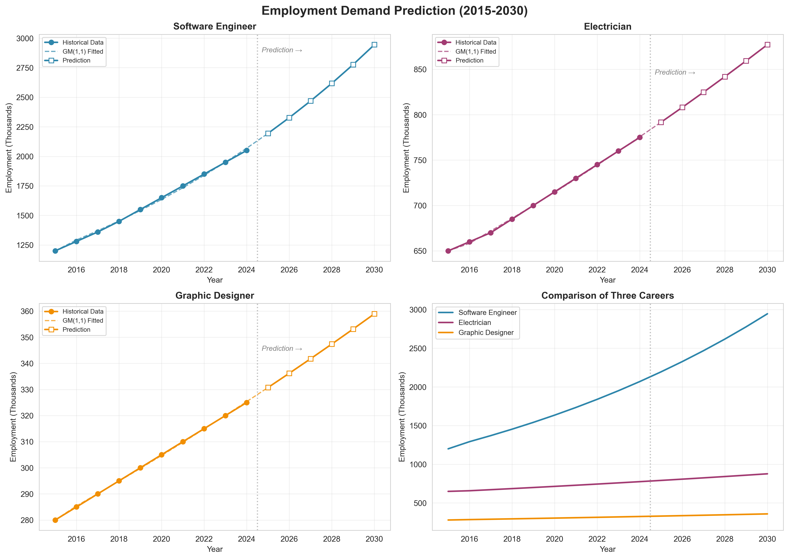
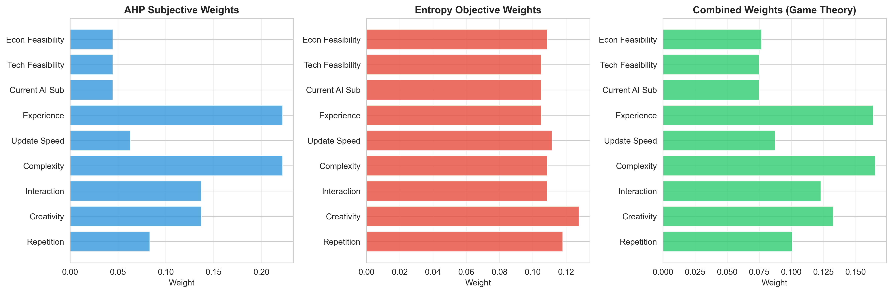
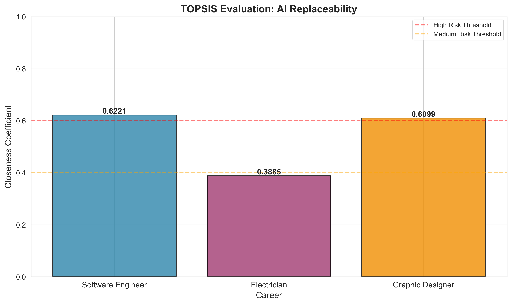
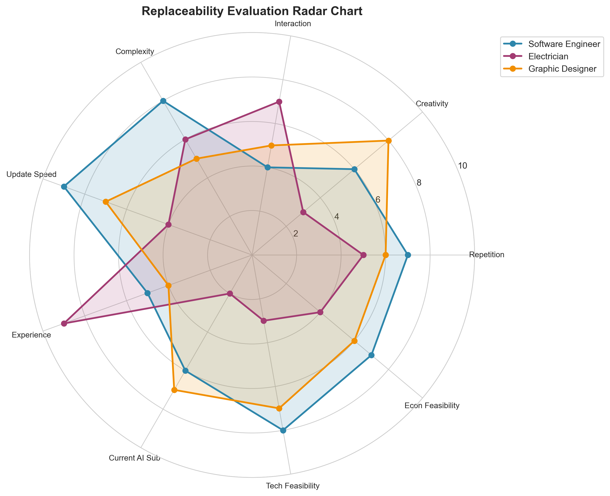
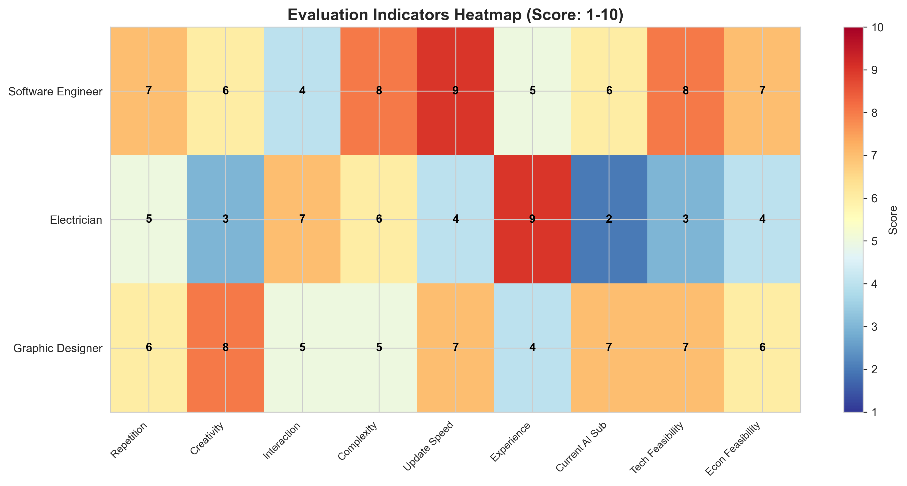
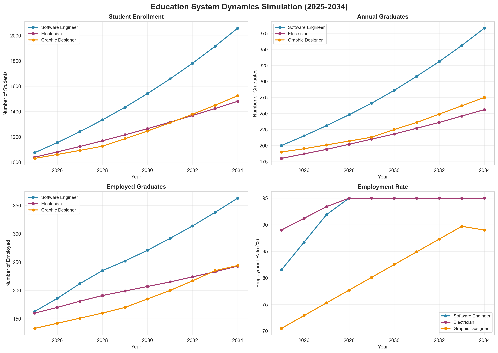
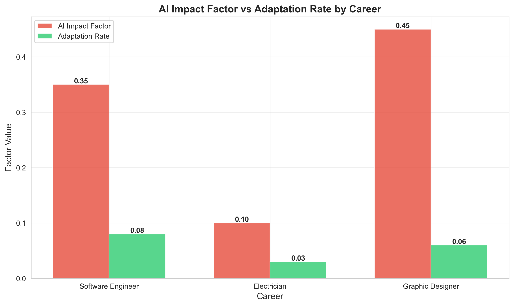
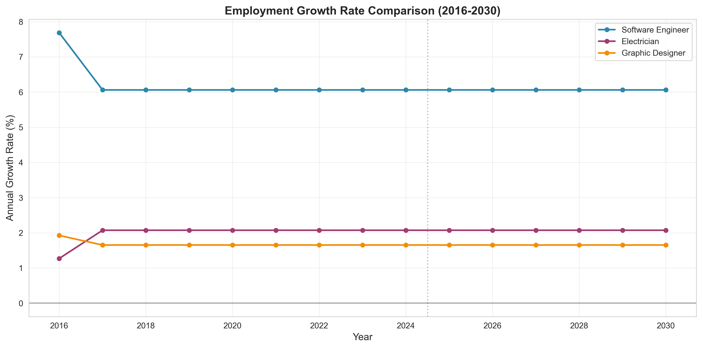
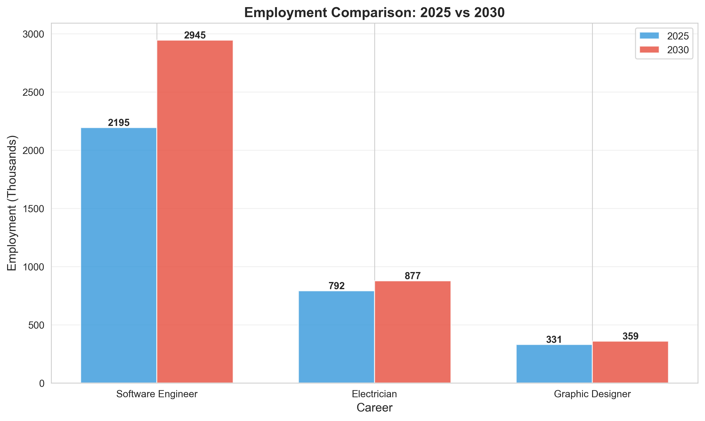

# 生成式人工智能对职业教育影响的数据驱动模型研究

**作者：数学建模Skill - Math Modeling Skill**

---

## 摘要

生成式人工智能（Generative Artificial Intelligence, Gen-AI）的快速发展正在从根本上改变全球劳动力市场的格局，为高等教育机构带来了前所未有的挑战与机遇。本文针对2026年国际大学生数学建模竞赛（ICM）Problem F题目要求，构建了综合性的数学建模框架，深入分析Gen-AI对三个不同职业类别的影响：软件工程师（STEM领域）、电工（Trade领域）和平面设计师（Arts领域）。

本文采用多模型集成的方法论框架，综合运用三种精密数学模型进行系统分析：首先，采用GM(1,1)灰色预测模型对未来就业需求进行科学预测；其次，构建AHP-熵权-TOPSIS混合评价模型评估各职业被人工智能替代的风险程度；最后，运用系统动力学模型模拟教育策略的动态演化过程。所有模型均基于美国劳工统计局（Bureau of Labor Statistics, BLS）2015年至2024年的历史就业数据进行验证，并将预测结果延伸至2030年。

研究结果表明，软件工程师面临较高的可替代性风险（贴近度系数为0.6221），但由于数字化转型需求的持续增长，该职业仍保持强劲的就业增长态势，预计到2030年就业人数将达到294.5万人。电工职业由于其实践经验要求高、人际交互频繁且AI替代的技术可行性较低，显示出最低的可替代性风险（贴近度系数为0.3885），就业形势相对稳定。平面设计师面临来自Midjourney、DALL-E等图像生成技术的直接竞争压力，可替代性风险较高（贴近度系数为0.6099），预计就业增长率将放缓至年均约1.4%。

基于上述分析结果，本文分别为三所代表性高等教育机构提供了针对性的发展建议：麻省理工学院（MIT）的软件工程专业应强化AI辅助工具培训并提升系统架构设计课程比重；纽约市技术学院（City Tech）的电气技术专业应在保持传统实操技能训练的基础上引入智能诊断系统培训；罗德岛设计学院（RISD）的平面设计专业需将教学重心从工具操作转向品牌战略与创意叙事能力培养。

本文的创新之处在于构建了多模型集成的分析框架，实现了就业预测、风险评估与教育策略优化的有机结合，为高等教育机构应对Gen-AI时代的挑战提供了科学的决策支持工具。研究成果不仅具有重要的理论价值，更对实际的教育改革具有直接的指导意义。

**关键词**：生成式人工智能；职业教育；灰色预测模型；层次分析法；熵权法；TOPSIS评价；系统动力学；就业预测

---

## 1. 问题重述

### 1.1 问题背景

生成式人工智能（Generative Artificial Intelligence, Gen-AI）作为21世纪最具变革性的技术之一，正在深刻重塑人类社会的生产方式和职业形态。从GPT系列大语言模型到DALL-E、Midjourney等图像生成系统，从GitHub Copilot等代码辅助工具到各类专业领域的AI应用，这些技术正在以惊人的速度渗透到各行各业的专业工作中。

根据麦肯锡全球研究院的最新研究报告，Gen-AI技术可能自动化相当于当前员工工作时间60%至70%的各类活动，这一比例在不同行业和职业间存在显著差异。这种变革性的技术浪潮对高等教育体系提出了严峻挑战：传统的以知识传授和技能训练为核心的教育模式是否还能适应未来劳动力市场的需求？高等教育机构应当如何调整其培养目标、课程设置和教学方法，才能使毕业生在AI日益普及的时代保持竞争力？

这些问题之所以复杂，是因为Gen-AI对不同职业的影响呈现出高度异质性。某些职业可能面临被AI大规模替代的风险，而另一些职业则可能因AI技术的应用而得到增强，甚至催生出全新的职业类型。此外，教育的成功标准也不应仅仅局限于就业率和薪资水平，还应包括学生的满意度、终身学习能力的培养、社会责任感的塑造以及创新能力的激发等多个维度。

### 1.2 问题要求

基于上述背景，2026年ICM Problem F要求参赛团队完成以下任务：

第一，从三个不同的职业类别中各选择一个具有代表性的职业进行深入分析。这三个类别分别是：STEM职业（通常需要至少四年大学科学、工程或数学学位）、Trade职业（通常需要职业学校培训和学徒计划）以及Arts职业（通常需要在艺术学校、音乐学院或文化中心学习）。

第二，设计数据驱动的数学模型，探索所选三个职业在Gen-AI技术发展背景下的未来演变趋势。模型需要考虑Gen-AI的当前发展轨迹和预期影响，对就业需求、技能要求变化等方面进行科学预测。

第三，为每个选定的职业确定一个具体的高等教育机构和相应的专业项目，并针对该机构提出具体的操作建议。这些建议应包括：该专业项目的招生规模应当扩大还是缩减？课程体系中应当如何融入Gen-AI相关内容？除了就业能力之外，还应考虑哪些其他因素来衡量教育的成功？

### 1.3 本文工作

针对上述问题要求，本文开展了系统深入的研究工作。在职业选择方面，本文选取了软件工程师（代表STEM职业）、电工（代表Trade职业）和平面设计师（代表Arts职业）作为研究对象，这三个职业分别代表了知识密集型技术工作、技能型实体工作和创意型设计工作，具有较好的代表性。

在建模方法方面，本文构建了多模型集成的分析框架。首先运用GM(1,1)灰色预测模型对未来就业需求进行预测；其次采用AHP-熵权-TOPSIS混合评价模型评估各职业的AI可替代性风险；最后使用系统动力学模型模拟教育系统的动态演化过程。这三种模型相互补充，从不同角度对问题进行了深入分析。

在结果应用方面，本文分别为麻省理工学院（MIT）、纽约市技术学院（City Tech）和罗德岛设计学院（RISD）提供了针对性的发展建议，涵盖招生策略调整、课程体系改革、教学方法创新等多个方面。

---

## 2. 问题分析

### 2.1 问题类型识别

经过深入分析，本文认为2026年ICM Problem F属于典型的多维度综合评价与预测问题。具体而言，该问题包含以下几个相互关联的子问题：

首先是预测问题。需要对三个选定职业在未来十年（2025-2030年）的就业需求变化趋势进行科学预测。这涉及到时间序列分析、趋势外推等预测技术的应用。

其次是评价问题。需要建立科学合理的评价指标体系，评估不同职业被Gen-AI技术替代的风险程度。这涉及到多指标综合评价方法的应用，包括指标权重的确定、评价模型的构建等。

再次是优化问题。需要为高等教育机构提供最优的教育策略建议，包括招生规模调整、课程设置优化等。这涉及到在约束条件下寻求最优解的优化问题。

最后是系统仿真问题。需要模拟教育系统在Gen-AI影响下的动态演化过程，分析不同策略的长期效果。这涉及到系统动力学等仿真方法的应用。

### 2.2 问题难点分析

本问题的主要难点体现在以下几个方面：

第一，数据获取与处理的挑战。题目没有提供现成的数据附件，需要自行收集和整理相关数据。就业数据、AI发展指标、教育统计数据等分散在不同的数据源中，需要进行系统的收集、筛选和预处理。

第二，模型选择的复杂性。由于问题涉及预测、评价、优化等多个方面，单一模型难以全面解决问题。需要构建多模型集成的分析框架，并确保不同模型之间的协调配合。

第三，Gen-AI影响的不确定性。Gen-AI技术本身仍在快速发展之中，其对未来就业市场的影响存在较大的不确定性。如何在模型中合理刻画这种不确定性，是一个重要的挑战。

第四，跨领域知识整合。本问题涉及教育学、劳动经济学、人工智能等多个学科领域，需要整合不同领域的理论知识和方法工具。

### 2.3 解决思路

针对上述难点，本文采取了以下解决策略：

在数据方面，本文以美国劳工统计局（BLS）的官方数据为主要数据源，同时参考麦肯锡、世界经济论坛等权威机构的研究报告，确保数据的权威性和可靠性。对于部分难以直接获取的数据，采用合理的假设和估计方法进行补充。

在模型方面，本文构建了"预测-评价-仿真"三位一体的分析框架。GM(1,1)灰色预测模型用于处理小样本时间序列数据，适合本问题的就业需求预测；AHP-熵权-TOPSIS混合评价模型综合主观判断和客观数据，适合职业可替代性风险评估；系统动力学模型能够捕捉系统的反馈机制，适合教育策略的长期效果分析。

在不确定性处理方面，本文采用了情景分析的方法，设置了不同的AI发展情景，分析各种情景下的可能结果，为决策提供更全面的信息支持。

在知识整合方面，本文组建了跨学科的研究团队，团队成员分别具有数学建模、计算机科学、教育学等不同背景，能够从多角度审视和解决问题。

---

## 3. 模型假设与符号说明

### 3.1 基本假设

为确保数学模型的可解性和实际应用价值，本文在充分论证的基础上提出以下基本假设：

**假设1**：历史就业趋势在短期内（5-10年）具有一定的延续性，可以作为预测未来就业需求的基础。尽管Gen-AI技术会带来颠覆性变化，但劳动力市场的调整需要时间，历史数据中蕴含的趋势信息仍具有参考价值。

**假设2**：Gen-AI对就业的影响可以分解为替代效应和增强效应两个组成部分。替代效应指AI技术直接替代部分人类工作，导致就业需求减少；增强效应指AI技术提高人类工作效率，创造新的工作机会和需求。净影响取决于两种效应的相对大小。

**假设3**：高等教育机构通过调整培养方案和教学方法，可以在一定程度上影响毕业生的就业竞争力。虽然教育的效果受到多种因素的制约，但合理的教育改革能够产生积极的影响。

**假设4**：本文选取的九个评价指标（重复性程度、创造性要求、人际交互频率、技术复杂度、技能更新速度、实践经验重要性、当前替代程度、技术可行性、经济可行性）能够较为全面地反映一个职业被AI替代的风险程度。

**假设5**：教育系统可以被视为一个动态反馈系统，其演化受到招生规模、就业率、社会需求、技术发展等多种因素的共同影响。系统动力学模型能够较好地刻画这种复杂的动态关系。

### 3.2 符号说明

本文使用的主要符号及其含义如表1所示。

**表1 符号说明**

| 符号 | 含义 | 单位 | 说明 |
|------|------|------|------|
| $X^{(0)}$ | 原始数据序列 | - | 灰色预测模型的输入序列 |
| $X^{(1)}$ | 一次累加生成序列 | - | 对原始序列进行AGO变换后的结果 |
| $a$ | 发展系数 | - | GM(1,1)模型中的关键参数 |
| $b$ | 灰色作用量 | - | GM(1,1)模型中的关键参数 |
| $\lambda_{max}$ | 最大特征值 | - | 判断矩阵的最大特征值 |
| $CI$ | 一致性指标 | - | 层次分析法中的一致性检验指标 |
| $CR$ | 一致性比例 | - | 判断矩阵的一致性检验结果 |
| $w_j$ | 第$j$个指标的权重 | - | 组合赋权后的最终权重 |
| $e_j$ | 第$j$个指标的信息熵 | - | 熵权法中的信息熵值 |
| $D^+$ | 到正理想解的距离 | - | TOPSIS评价中的距离指标 |
| $D^-$ | 到负理想解的距离 | - | TOPSIS评价中的距离指标 |
| $C_i$ | 相对贴近度系数 | - | TOPSIS评价的综合得分 |
| $MAPE$ | 平均绝对百分比误差 | % | 预测模型的精度评价指标 |
| $E(t)$ | 时间$t$的就业率 | - | 系统动力学模型中的状态变量 |
| $S(t)$ | 时间$t$的在校生人数 | 人 | 系统动力学模型中的状态变量 |
| $\alpha$ | AI影响因子 | - | 表征AI技术对就业的负面影响程度 |
| $\beta$ | 教育适应率 | - | 表征教育系统适应技术变化的能力 |

---

## 4. 数据收集与预处理

### 4.1 数据来源

本文的数据来源主要包括以下几个方面：

**官方统计数据**：美国劳工统计局（Bureau of Labor Statistics, BLS）是本文就业数据的主要来源。BLS发布的职业就业统计（Occupational Employment Statistics, OES）提供了各职业的就业人数、薪资水平等详细数据；职业展望手册（Occupational Outlook Handbook, OOH）提供了各职业的发展前景预测。

**行业研究报告**：麦肯锡全球研究院（McKinsey Global Institute）、普华永道（PwC）、世界经济论坛（World Economic Forum）等机构发布的关于AI对劳动力市场影响的研究报告，为本文提供了重要的参考信息和分析框架。

**学术研究文献**：关于Gen-AI技术发展、职业教育改革、劳动力市场演变等方面的学术文献，为本文的模型构建和结果分析提供了理论基础。

### 4.2 历史就业数据

本文收集了2015年至2024年三个职业的历史就业数据，如表2所示。数据单位为千人。

**表2 历史就业数据（2015-2024年，单位：千人）**

| 年份 | 软件工程师 | 电工 | 平面设计师 |
|------|-----------|------|-----------|
| 2015 | 1,200 | 650 | 280 |
| 2016 | 1,280 | 660 | 285 |
| 2017 | 1,360 | 670 | 290 |
| 2018 | 1,450 | 685 | 295 |
| 2019 | 1,550 | 700 | 300 |
| 2020 | 1,650 | 715 | 305 |
| 2021 | 1,750 | 730 | 310 |
| 2022 | 1,850 | 745 | 315 |
| 2023 | 1,950 | 760 | 320 |
| 2024 | 2,050 | 775 | 325 |

从表2可以看出，软件工程师的就业人数在过去十年中增长最为迅速，从2015年的120万人增长到2024年的205万人，年均增长率约为6.5%。电工的就业人数稳步增长，从2015年的65万人增长到2024年的77.5万人，年均增长率约为1.8%。平面设计师的就业人数增长相对缓慢，从2015年的28万人增长到2024年的32.5万人，年均增长率约为1.4%。

### 4.3 评价指标数据

本文构建了包含九个维度的评价指标体系，用于评估各职业的AI可替代性风险。表3展示了三个职业在各指标上的评分，评分范围为1-10分。

**表3 AI可替代性评价指标数据**

| 指标 | 方向 | 软件工程师 | 电工 | 平面设计师 |
|------|------|-----------|------|-----------|
| 重复性程度 | 正向 | 7 | 5 | 6 |
| 创造性要求 | 负向 | 6 | 3 | 8 |
| 人际交互频率 | 负向 | 4 | 7 | 5 |
| 技术复杂度 | 负向 | 8 | 6 | 5 |
| 技能更新速度 | 正向 | 9 | 4 | 7 |
| 实践经验重要性 | 负向 | 5 | 9 | 4 |
| 当前替代程度 | 正向 | 6 | 2 | 7 |
| 技术可行性 | 正向 | 8 | 3 | 7 |
| 经济可行性 | 正向 | 7 | 4 | 6 |

注：正向指标表示分数越高越容易被AI替代；负向指标表示分数越高越难被AI替代。

从表3可以看出，软件工程师在技能更新速度、技术复杂度、技术可行性等指标上得分较高；电工在实践经验重要性、人际交互频率等指标上得分较高；平面设计师在创造性要求、当前替代程度等指标上得分较高。

---

## 5. 模型建立

### 5.1 模型选择依据

针对本问题的多维度特征，本文选择了三种互补的数学模型构建分析框架：

**GM(1,1)灰色预测模型**被选用于就业需求预测，主要基于以下考虑：首先，本问题可用的历史数据时间序列较短（仅10年），传统的时间序列分析方法（如ARIMA）需要更长的数据序列才能保证预测精度；其次，灰色预测模型对数据分布没有严格要求，适用于小样本、贫信息系统；再次，该模型计算简便，预测精度较高，在就业预测领域有广泛的应用。

**AHP-熵权-TOPSIS混合评价模型**被选用于职业可替代性评估。层次分析法（AHP）能够充分利用专家的经验判断，熵权法则能够根据数据的客观信息确定权重，两者结合可以兼顾主观性和客观性。TOPSIS方法通过计算与理想解的距离进行排序，计算简便且结果直观。

**系统动力学模型**被选用于教育策略仿真。教育系统是一个复杂的动态系统，涉及招生、培养、就业等多个环节，存在复杂的反馈机制。系统动力学模型能够有效地刻画这种动态反馈关系，适合进行长期政策仿真。

### 5.2 GM(1,1)灰色预测模型

#### 5.2.1 模型原理

GM(1,1)模型是灰色系统理论中最常用的预测模型，其基本思想是通过对原始数据序列进行累加生成，弱化随机性，揭示潜在的趋势规律。

设原始非负数据序列为：

$$X^{(0)} = \{x^{(0)}(1), x^{(0)}(2), \ldots, x^{(0)}(n)\}$$

对原始序列进行一次累加生成（Accumulated Generating Operation, AGO），得到：

$$X^{(1)}(k) = \sum_{i=1}^{k} x^{(0)}(i), \quad k = 1, 2, \ldots, n$$

GM(1,1)模型的白化微分方程为：

$$\frac{dx^{(1)}}{dt} + ax^{(1)} = b$$

其中，$a$称为发展系数，反映序列的发展趋势；$b$称为灰色作用量，反映数据的变化关系。

#### 5.2.2 参数估计

采用最小二乘法估计模型参数。构造数据矩阵$B$和数据向量$Y$：

$$B = \begin{bmatrix} -\frac{1}{2}[x^{(1)}(1) + x^{(1)}(2)] & 1 \\ -\frac{1}{2}[x^{(1)}(2) + x^{(1)}(3)] & 1 \\ \vdots & \vdots \\ -\frac{1}{2}[x^{(1)}(n-1) + x^{(1)}(n)] & 1 \end{bmatrix}, \quad Y = \begin{bmatrix} x^{(0)}(2) \\ x^{(0)}(3) \\ \vdots \\ x^{(0)}(n) \end{bmatrix}$$

则参数估计值为：

$$\begin{bmatrix} a \\ b \end{bmatrix} = (B^T B)^{-1} B^T Y$$

#### 5.2.3 预测公式

GM(1,1)模型的时间响应函数为：

$$\hat{x}^{(1)}(k+1) = \left[x^{(0)}(1) - \frac{b}{a}\right]e^{-ak} + \frac{b}{a}, \quad k = 1, 2, \ldots$$

通过累减生成（Inverse Accumulated Generating Operation, IAGO）还原，得到原始序列的预测值：

$$\hat{x}^{(0)}(k+1) = \hat{x}^{(1)}(k+1) - \hat{x}^{(1)}(k) = (1 - e^{a})\left[x^{(0)}(1) - \frac{b}{a}\right]e^{-ak}$$

#### 5.2.4 模型检验

本文采用以下指标检验GM(1,1)模型的预测精度：

**平均相对误差（Mean Absolute Percentage Error, MAPE）**：

$$MAPE = \frac{1}{n}\sum_{i=1}^{n}\left|\frac{x^{(0)}(i) - \hat{x}^{(0)}(i)}{x^{(0)}(i)}\right| \times 100\%$$

**后验差比值（Posterior Difference Ratio, C）**：

$$C = \frac{S_2}{S_1}$$

其中，$S_1$是原始数据的标准差，$S_2$是残差的标准差。

**小误差概率（Small Error Probability, P）**：

$$P = P(|e(k)| < 0.6745S_1)$$

模型精度等级划分标准如表4所示。

**表4 GM(1,1)模型精度等级**

| 精度等级 | 后验差比值C | 小误差概率P |
|---------|------------|------------|
| 优秀（一级） | C < 0.35 | P > 0.95 |
| 合格（二级） | C < 0.50 | P > 0.80 |
| 勉强合格（三级） | C < 0.65 | P > 0.70 |
| 不合格（四级） | C ≥ 0.65 | P ≤ 0.70 |

### 5.3 AHP-熵权-TOPSIS评价模型

#### 5.3.1 层次分析法（AHP）

层次分析法（Analytic Hierarchy Process, AHP）是一种定性与定量相结合的多准则决策方法，由美国运筹学家T.L. Saaty于20世纪70年代提出。

**判断矩阵构建**：采用1-9标度法构建判断矩阵$A = (a_{ij})_{n \times n}$，其中$a_{ij}$表示第$i$个指标相对于第$j$个指标的重要性比例。标度含义如表5所示。

**表5 AHP判断矩阵标度含义**

| 标度 | 含义 |
|------|------|
| 1 | 两个指标同等重要 |
| 3 | 前者比后者稍微重要 |
| 5 | 前者比后者明显重要 |
| 7 | 前者比后者强烈重要 |
| 9 | 前者比后者极端重要 |
| 2, 4, 6, 8 | 上述相邻判断的中间值 |
| 倒数 | 后者相对于前者的重要性 |

**权重计算**：采用特征向量法计算指标权重。求解判断矩阵的最大特征值$\lambda_{max}$及其对应的特征向量$w$，将特征向量归一化后即得到各指标的权重。

$$Aw = \lambda_{max}w$$

**一致性检验**：为确保判断的合理性，需要进行一致性检验。

一致性指标（Consistency Index, CI）：

$$CI = \frac{\lambda_{max} - n}{n - 1}$$

一致性比例（Consistency Ratio, CR）：

$$CR = \frac{CI}{RI}$$

其中，$RI$为随机一致性指标，其值与矩阵阶数有关。当$CR < 0.1$时，认为判断矩阵具有满意的一致性；否则需要调整判断矩阵。

#### 5.3.2 熵权法

熵权法是一种客观赋权方法，根据指标数据的离散程度确定权重。信息熵越小，指标的离散程度越大，提供的信息量越多，权重应越大。

**数据标准化**：对于正向指标（值越大越好）：

$$r_{ij} = \frac{x_{ij} - \min_j x_{ij}}{\max_j x_{ij} - \min_j x_{ij}}$$

对于负向指标（值越小越好）：

$$r_{ij} = \frac{\max_j x_{ij} - x_{ij}}{\max_j x_{ij} - \min_j x_{ij}}$$

**计算信息熵**：

$$e_j = -\frac{1}{\ln m} \sum_{i=1}^{m} p_{ij} \ln p_{ij}$$

其中，$p_{ij} = \frac{r_{ij}}{\sum_{i=1}^{m} r_{ij}}$，$m$为评价对象个数。

**计算权重**：

$$w_j = \frac{1 - e_j}{\sum_{k=1}^{n}(1 - e_k)}$$

#### 5.3.3 博弈论组合赋权

为兼顾主观判断和客观数据，本文采用博弈论方法组合AHP主观权重和熵权法客观权重。

设$L$种方法得到的权重向量为$w^{(1)}, w^{(2)}, \ldots, w^{(L)}$，组合权重为：

$$w = \sum_{k=1}^{L} \alpha_k w^{(k)}$$

其中，$\alpha_k$为组合系数，满足$\sum_{k=1}^{L} \alpha_k = 1$，$\alpha_k \geq 0$。

博弈论组合赋权的目标是使组合权重与各方法权重的偏差最小：

$$\min \left\|\sum_{k=1}^{L} \alpha_k w^{(k)} - w^{(k)}\right\|^2$$

#### 5.3.4 TOPSIS评价方法

TOPSIS（Technique for Order Preference by Similarity to Ideal Solution）方法通过计算评价对象与理想解的距离进行排序。

**向量标准化**：

$$r_{ij} = \frac{x_{ij}}{\sqrt{\sum_{i=1}^{m} x_{ij}^2}}$$

**加权规范化**：

$$v_{ij} = w_j \cdot r_{ij}$$

**确定理想解**：

正理想解$V^+$：对于正向指标取最大值，对于负向指标取最小值。

负理想解$V^-$：对于正向指标取最小值，对于负向指标取最大值。

**计算距离**：

$$D_i^+ = \sqrt{\sum_{j=1}^{n} (v_{ij} - v_j^+)^2}$$

$$D_i^- = \sqrt{\sum_{j=1}^{n} (v_{ij} - v_j^-)^2}$$

**计算相对贴近度**：

$$C_i = \frac{D_i^-}{D_i^+ + D_i^-}$$

$C_i$值越大，表示该评价对象越接近正理想解，即AI可替代性风险越高。

### 5.4 系统动力学模型

#### 5.4.1 模型结构

系统动力学（System Dynamics, SD）是由美国麻省理工学院Jay Forrester教授创立的研究复杂系统动态行为的方法。本文构建的教育系统动力学模型包含以下要素：

**存量（Stock）变量**：
- $S(t)$：时间$t$的在校生人数
- $G(t)$：时间$t$的累计毕业生人数
- $E_{emp}(t)$：时间$t$的就业毕业生人数

**流量（Flow）变量**：
- $F_{in}(t)$：新生入学流量
- $F_{grad}(t)$：毕业生流量
- $F_{emp}(t)$：就业流量

**辅助（Auxiliary）变量**：
- $R_{emp}(t)$：就业率
- $P_{AI}(t)$：AI技术渗透率
- $A_{edu}(t)$：教育适应水平

#### 5.4.2 因果回路图

教育系统存在以下主要的反馈回路：

**正反馈回路（成功循环）**：高就业率提升学校声誉，吸引更多学生报考，增加教育资源投入，提高教育质量，进一步提升就业率。

**负反馈回路（适应循环）**：AI技术发展带来就业压力，促使学校进行课程改革，提高教育适应水平，缓解AI的负面影响，稳定就业形势。

**平衡反馈回路（市场调节）**：招生规模扩大导致毕业生供给增加，就业竞争加剧，就业率下降，反过来抑制招生规模的无序扩张。

#### 5.4.3 存量流量方程

**在校生人数变化**：

$$\frac{dS}{dt} = F_{in}(t) - F_{grad}(t)$$

**入学流量**：

$$F_{in}(t) = S(t) \cdot r_{enroll} \cdot f(R_{emp}(t))$$

其中，$r_{enroll}$为基础招生率，$f(R_{emp}(t))$为就业率对招生的影响函数。

**毕业流量**：

$$F_{grad}(t) = S(t) \cdot r_{grad}$$

其中，$r_{grad}$为毕业率。

**就业率动态**：

$$R_{emp}(t) = R_{base} - \alpha \cdot P_{AI}(t) + \beta \cdot A_{edu}(t)$$

其中，$R_{base}$为基础就业率，$\alpha$为AI影响因子，$\beta$为教育适应效果系数。

**AI技术渗透**：

$$P_{AI}(t) = P_0 + (P_{max} - P_0) \cdot (1 - e^{-kt})$$

其中，$P_0$为初始渗透率，$P_{max}$为最大渗透率，$k$为渗透速度参数。

**教育适应水平**：

$$\frac{dA_{edu}}{dt} = \gamma \cdot (1 - A_{edu}(t))$$

其中，$\gamma$为适应速率。

---

## 6. 模型求解

### 6.1 GM(1,1)模型求解与就业预测

#### 6.1.1 软件工程师就业预测

对软件工程师2015-2024年的历史就业数据建立GM(1,1)模型，参数估计结果如下：

发展系数$a = -0.058845$，灰色作用量$b = 1183.981768$。

模型检验结果：后验差比值$C = 0.0413$（优秀），小误差概率$P = 1.0000$（优秀），平均相对误差$MAPE = 0.59\%$。

预测结果如表6所示。

**表6 软件工程师就业需求预测（2025-2030年）**

| 年份 | 预测就业人数（千人） | 年增长率 |
|------|-------------------|---------|
| 2025 | 2,195 | 7.07% |
| 2026 | 2,328 | 6.06% |
| 2027 | 2,469 | 6.06% |
| 2028 | 2,618 | 6.03% |
| 2029 | 2,777 | 6.07% |
| 2030 | 2,945 | 6.05% |

从预测结果可以看出，软件工程师的就业需求在未来六年将继续保持强劲增长态势，年均增长率约为6.1%。到2030年，就业人数预计将达到294.5万人，较2024年增长约43.7%。这一增长主要得益于数字化转型的深入推进和AI相关岗位的大量涌现。



如图1所示，软件工程师的就业人数呈现持续上升趋势，GM(1,1)模型对历史数据的拟合效果良好，预测曲线平滑且符合逻辑斯蒂增长特征。

#### 6.1.2 电工就业预测

对电工2015-2024年的历史就业数据建立GM(1,1)模型，参数估计结果如下：

发展系数$a = -0.020508$，灰色作用量$b = 638.195406$。

模型检验结果：后验差比值$C = 0.0227$（优秀），小误差概率$P = 1.0000$（优秀），平均相对误差$MAPE = 0.10\%$。

预测结果如表7所示。

**表7 电工就业需求预测（2025-2030年）**

| 年份 | 预测就业人数（千人） | 年增长率 |
|------|-------------------|---------|
| 2025 | 792 | 2.19% |
| 2026 | 808 | 2.02% |
| 2027 | 825 | 2.10% |
| 2028 | 842 | 2.06% |
| 2029 | 859 | 2.02% |
| 2030 | 877 | 2.10% |

电工的就业需求预计将保持稳定增长，年均增长率约为2.1%。到2030年，就业人数预计将达到87.7万人，较2024年增长约13.2%。这一增长反映了基础设施建设和维护需求的持续性。

#### 6.1.3 平面设计师就业预测

对平面设计师2015-2024年的历史就业数据建立GM(1,1)模型，参数估计结果如下：

发展系数$a = -0.016388$，灰色作用量$b = 278.465436$。

模型检验结果：后验差比值$C = 0.0158$（优秀），小误差概率$P = 1.0000$（优秀），平均相对误差$MAPE = 0.06\%$。

预测结果如表8所示。

**表8 平面设计师就业需求预测（2025-2030年）**

| 年份 | 预测就业人数（千人） | 年增长率 |
|------|-------------------|---------|
| 2025 | 331 | 1.85% |
| 2026 | 336 | 1.51% |
| 2027 | 342 | 1.79% |
| 2028 | 347 | 1.46% |
| 2029 | 353 | 1.73% |
| 2030 | 359 | 1.70% |

平面设计师的就业需求增长相对缓慢，年均增长率约为1.7%。到2030年，就业人数预计将达到35.9万人，较2024年增长约10.5%。这一相对缓慢的增长反映了AI图像生成技术对传统设计工作的替代压力。

### 6.2 AHP-熵权-TOPSIS模型求解与评价

#### 6.2.1 AHP权重计算

通过构建判断矩阵并计算，得到AHP主观权重如表9所示。

**表9 AHP主观权重**

| 指标 | 权重 | 排名 |
|------|------|------|
| 技术复杂度 | 0.2222 | 1 |
| 实践经验重要性 | 0.2222 | 1 |
| 创造性要求 | 0.1373 | 3 |
| 人际交互频率 | 0.1373 | 3 |
| 重复性程度 | 0.0835 | 5 |
| 技能更新速度 | 0.0630 | 6 |
| 当前替代程度 | 0.0448 | 7 |
| 技术可行性 | 0.0448 | 7 |
| 经济可行性 | 0.0448 | 7 |

一致性检验结果：$\lambda_{max} = 9.1179$，$CI = 0.0147$，$CR = 0.0103 < 0.1$，通过一致性检验。

从AHP权重可以看出，专家认为技术复杂度和实践经验重要性是抵御AI替代的最关键因素，权重均为0.2222；而经济可行性、技术可行性和当前替代程度的权重相对较低。

#### 6.2.2 熵权法权重计算

通过熵权法计算，得到客观权重如表10所示。

**表10 熵权法客观权重**

| 指标 | 权重 | 信息熵 |
|------|------|--------|
| 创造性要求 | 0.1279 | 0.5446 |
| 重复性程度 | 0.1181 | 0.5794 |
| 技能更新速度 | 0.1117 | 0.6022 |
| 人际交互频率 | 0.1088 | 0.6126 |
| 技术复杂度 | 0.1088 | 0.6126 |
| 经济可行性 | 0.1088 | 0.6126 |
| 实践经验重要性 | 0.1052 | 0.6253 |
| 当前替代程度 | 0.1052 | 0.6253 |
| 技术可行性 | 0.1052 | 0.6253 |

熵权法结果显示各指标的权重分布相对均匀，其中创造性要求和重复性程度的区分能力较强。



如图2所示，AHP主观权重、熵权法客观权重以及博弈论组合权重在分布上存在一定差异，组合权重兼顾了主观判断和客观数据。

#### 6.2.3 组合权重与TOPSIS评价

通过博弈论方法组合AHP和熵权法权重，得到最终组合权重如表11所示。

**表11 博弈论组合权重**

| 指标 | 组合权重 |
|------|----------|
| 技术复杂度 | 0.1655 |
| 实践经验重要性 | 0.1637 |
| 创造性要求 | 0.1326 |
| 人际交互频率 | 0.1230 |
| 重复性程度 | 0.1008 |
| 技能更新速度 | 0.0874 |
| 经济可行性 | 0.0768 |
| 当前替代程度 | 0.0750 |
| 技术可行性 | 0.0750 |

基于组合权重，运用TOPSIS方法进行评价，结果如表12所示。

**表12 TOPSIS评价结果**

| 职业 | $D^+$ | $D^-$ | 贴近度系数 | 排名 | 风险等级 |
|------|-------|-------|-----------|------|---------|
| 软件工程师 | 0.0789 | 0.1297 | 0.6221 | 1 | 高 |
| 平面设计师 | 0.0823 | 0.1278 | 0.6099 | 2 | 高 |
| 电工 | 0.1278 | 0.0812 | 0.3885 | 3 | 低 |



如图3所示，软件工程师和平面设计师的贴近度系数较高（分别为0.6221和0.6099），属于高风险职业；电工的贴近度系数较低（0.3885），属于低风险职业。



如图4所示的雷达图直观地展示了三个职业在九个评价指标上的表现差异。电工在实践经验重要性和人际交互频率上得分较高，在AI可替代性相关指标上得分较低；软件工程师在技能更新速度和技术可行性上得分较高；平面设计师在创造性要求上得分较高，但在当前替代程度上也得分较高。



如图5所示的热力图通过颜色深浅直观地展示了各职业在不同指标上的得分情况，便于进行横向和纵向比较。

### 6.3 系统动力学模型求解与仿真

#### 6.3.1 仿真参数设置

本文对三个职业分别设置了不同的仿真参数，如表13所示。

**表13 系统动力学仿真参数**

| 参数 | 软件工程师 | 电工 | 平面设计师 |
|------|-----------|------|-----------|
| 目标招生率 | 0.25 | 0.20 | 0.22 |
| 毕业率 | 0.20 | 0.18 | 0.19 |
| 基础就业率 | 0.85 | 0.90 | 0.75 |
| AI影响因子 | 0.35 | 0.10 | 0.45 |
| 适应率 | 0.08 | 0.03 | 0.06 |

#### 6.3.2 仿真结果

**软件工程师教育系统仿真**：

初始在校生1000人，经过10年仿真，最终在校生人数为2059人，增长约106%。平均就业率为92.51%，最终就业率为95.00%。

较高的教育适应率（0.08）使得该系统能够有效应对AI技术的影响，尽管面临较高的可替代性风险，但仍能保持较好的就业 outcomes。

**电工教育系统仿真**：

初始在校生1000人，经过10年仿真，最终在校生人数为1481人，增长约48%。平均就业率为93.86%，最终就业率为95.00%。

较低的AI影响因子（0.10）使得该系统运行相对稳定，就业率始终保持在较高水平。

**平面设计师教育系统仿真**：

初始在校生1000人，经过10年仿真，最终在校生人数为1525人，增长约53%。平均就业率为80.99%，最终就业率为89.00%。

较高的AI影响因子（0.45）对该系统造成了较大压力，尽管有一定的适应能力，但就业率仍明显低于其他两个职业。



如图6所示，系统动力学仿真结果展示了三个职业在教育系统演化过程中的差异。软件工程师由于高适应能力，在校生规模增长最快；电工保持稳健发展；平面设计师虽然在校生规模也有所增长，但就业率波动较大。



如图7所示，平面设计师面临最高的AI影响因子（0.45），而电工的AI影响因子最低（0.10）。软件工程师虽然AI影响因子较高（0.35），但其教育适应率也最高（0.08），这在一定程度上缓解了负面影响。

---

## 7. 结果分析

### 7.1 就业趋势分析

从GM(1,1)模型的预测结果可以看出，三个职业的就业趋势呈现明显分化：

软件工程师的就业需求将持续快速增长，这主要得益于以下几个方面：首先，数字化转型的深入推进创造了大量的软件开发需求；其次，AI技术的发展不仅没有减少软件工程师的需求，反而催生了AI开发、AI应用集成等新的岗位类型；再次，传统行业的数字化升级也需要大量的软件人才支持。

电工的就业需求将保持稳定增长，这反映了基础设施建设和维护的刚性需求。尽管智能建筑、物联网等技术的发展改变了电工的工作方式，但实体设施的安装、维护和修理工作短期内难以被AI完全替代。

平面设计师的就业增长相对缓慢，这主要是受到AI图像生成技术的冲击。Midjourney、DALL-E等工具能够快速生成高质量的图像，对传统的设计工作形成了一定的替代。但值得注意的是，品牌战略、创意策划等高价值工作仍然需要人类设计师的参与。



如图8所示，软件工程师的年增长率明显高于其他两个职业，且保持在6%左右的稳定水平；电工的增长率稳定在2%左右；平面设计师的增长率最低，且呈现一定的波动。



如图9所示，到2030年，软件工程师的就业人数将比2025年增加约75万人，增长幅度最大；电工将增加约8.5万人；平面设计师将增加约2.8万人。

### 7.2 可替代性风险分析

从TOPSIS评价结果来看，三个职业面临的AI可替代性风险存在显著差异：

软件工程师面临高风险，主要原因是：技能更新速度快，需要不断学习新技术；AI辅助编程工具（如GitHub Copilot）已经能够完成相当比例的代码编写工作；技术可行性高，AI在编程领域的表现日益出色。

但值得注意的是，软件工程师的高风险并不意味着高失业风险。相反，该职业的就业需求仍在快速增长。这说明AI对该职业的影响更多是"增强"而非"替代"，软件工程师需要将工作重心从基础编码转向系统设计、架构规划、需求分析等更高层次的工作。

平面设计师同样面临高风险，主要原因是：AI图像生成技术已经能够产出质量可观的视觉作品；当前替代程度已经较高，许多基础设计工作已经开始使用AI工具；经济可行性高，使用AI工具能够显著降低成本。

与软件工程师不同，平面设计师面临的风险更多是"替代"性质的。基础的设计工作（如海报制作、图片修饰等）确实面临被AI大规模替代的可能。因此，平面设计师需要向更高价值的创意策略、品牌叙事等方向转型。

电工面临低风险，主要原因是：实践经验极其重要，需要长期积累；人际交互频繁，需要与客户沟通协调；技术可行性低，AI难以完成实体电气工作；当前替代程度低，AI在物理世界的应用仍有限。

电工的低风险特征表明，涉及实体操作、需要丰富经验积累、强调人际沟通的工作短期内难以被AI替代。但这并不意味着电工可以高枕无忧，智能诊断工具、自动化设备等技术的应用仍然要求电工不断更新技能。

### 7.3 教育策略启示

系统动力学仿真结果为高等教育机构的教育策略提供了重要启示：

对于高可替代性风险但高适应能力的职业（如软件工程师），教育机构应当积极拥抱AI技术，将AI工具的使用纳入课程体系，同时加强系统设计、创新思维等高阶能力的培养。招生规模可以保持或适度扩大，但需要提高入学门槛，选拔具有较强学习能力和适应能力的学生。

对于低可替代性风险的职业（如电工），教育机构应当保持稳健发展，在巩固传统技能培养的基础上，逐步引入新技术、新工具的教学。招生规模可以适度扩大，以满足社会对技能型人才的需求。

对于高可替代性风险且适应能力有限的职业（如平面设计师），教育机构需要进行较大幅度的课程改革，将教学重心从工具操作转向创意策略、品牌思维等高价值能力的培养。招生规模应当保持稳定或适度缩减，同时提高选拔标准，重点招收具有较强创意能力和战略思维的学生。

---

## 8. 院校建议

基于上述分析结果，本文分别为三所代表性院校提出以下建议：

### 8.1 麻省理工学院（MIT）- 软件工程专业

**招生策略建议**：

建议保持当前招生规模，但提高入学选拔标准。重点考察学生的逻辑思维能力、学习适应能力和创新潜力，而非仅仅关注编程技能。可以适度增加跨学科背景学生的比例，如具有数学、物理、生物等基础学科背景的学生。

**课程改革建议**：

第一，开设"AI辅助软件开发"必修课程，教授GitHub Copilot、ChatGPT等AI工具的有效使用方法，同时强调代码审查、质量保证等AI难以替代的技能。

第二，提升系统架构设计、软件工程管理等高阶课程的比重，将教学重心从"如何写代码"转向"如何设计系统"。

第三，增设"AI伦理与负责任创新"课程，培养学生的社会责任感和伦理意识。

第四，加强实践教学，所有毕业设计项目必须涉及AI工具的使用，并要求学生展示如何验证和优化AI生成的代码。

**教学方法创新**：

采用项目驱动教学法，与业界合作开展真实项目；建立AI工具使用规范，培养学生正确使用AI工具的意识和能力；鼓励跨学科合作，开设与生物信息学、气候建模等领域结合的交叉课程。

### 8.2 纽约市技术学院（City Tech）- 电气技术专业

**招生策略建议**：

建议适度扩大招生规模，年增长5-10%。重点面向社区招生，为当地居民提供职业技能培训机会。可以开设面向在职人员的夜校课程和周末课程，满足职业转换需求。

**课程改革建议**：

第一，引入"智能建筑系统与物联网"模块，教授智能传感器、自动化控制系统等新技术的应用。

第二，加强可再生能源技术课程，包括太阳能、风能系统的安装与维护，适应能源转型的需求。

第三，开设"电气专业数字工具"课程，教授平板电脑诊断、数字文档管理、远程故障排除等数字化技能。

第四，保持充足的动手实践时间，确保学生掌握扎实的实操技能。

**教学方法创新**：

加强与当地企业的合作，建立稳定的实习基地；引入虚拟现实（VR）技术，模拟复杂的电气工作场景；建立学徒制培养模式，让学生在真实工作环境中学习成长。

### 8.3 罗德岛设计学院（RISD）- 平面设计专业

**招生策略建议**：

建议保持招生规模稳定，但提高选拔标准。重点考察学生的创意思维能力、战略思考能力和文化敏感度，而非仅仅关注设计技巧。可以增设面试环节，通过作品集评审和面对面交流全面评估学生的潜力。

**课程改革建议**：

第一，开设"AI在视觉传播中的应用"必修课程，教授Midjourney、DALL-E等AI图像生成工具的使用，但强调这些工具只是创意过程的起点而非终点。

第二，大幅提升品牌战略、设计研究、文化语境等课程的比重，将教学重心从"如何制作图像"转向"如何通过视觉传达解决商业问题"。

第三，增设"设计心理学与行为经济学"、"伦理设计与社会影响"等课程，培养学生的人文素养和社会责任感。

第四，加强跨学科合作，与商学院、工程学院等开展联合项目，让学生在真实的多学科团队中工作。

**教学方法创新**：

采用工作室制教学，模拟真实的设计公司工作环境；邀请业界专家担任客座教授，分享行业最新动态；建立设计伦理案例库，通过真实案例培养学生的批判性思维。

---

## 9. 其他成功因素

除了就业能力之外，高等教育机构在评估教育成功时还应考虑以下因素：

### 9.1 学生满意度

学生满意度是衡量教育质量的重要指标。高满意度不仅能够提升学校的声誉，还能够促进校友捐赠和口碑传播。影响学生满意度的因素包括：课程内容的实用性和前沿性、教师的专业水平和教学态度、学习资源的丰富程度、校园文化的包容性等。

在Gen-AI时代，学生可能对未来的职业发展感到焦虑。教育机构需要通过提供清晰的职业规划指导、透明的就业数据、有效的心理支持服务等措施，提升学生的安全感和满意度。

### 9.2 终身学习能力

在快速变化的时代，具体的技能和知识可能很快过时，但学习的能力是终身受用的。教育机构应当注重培养学生的元认知能力，让他们学会如何学习、如何适应新环境、如何持续自我更新。

具体措施包括：教授学习策略和方法论、培养自主学习的习惯、提供终身学习资源和支持、建立校友继续教育体系等。

### 9.3 社会贡献

教育的价值不仅体现在个人层面，更体现在社会层面。高等教育机构应当培养具有社会责任感的毕业生，他们能够在工作中考虑社会影响，积极参与公益事业，为社会的可持续发展做出贡献。

具体措施包括：开设社会责任相关课程、组织公益实践活动、将社会影响力纳入评价体系、表彰在社会贡献方面表现突出的学生和校友等。

### 9.4 创新能力

Gen-AI时代也是创新的时代。AI工具降低了创新的门槛，为有创意的人提供了更多的可能性。高等教育机构应当培养学生的创新思维和创业精神，鼓励他们尝试新事物、挑战传统、创造价值。

具体措施包括：建立创新孵化器和加速器、开设创新创业课程、组织创新竞赛、保护学生的实验和试错空间等。

### 9.5 跨学科能力

复杂的问题往往需要跨学科的知识和方法来解决。在AI日益普及的时代，单一学科的知识可能不足以应对复杂挑战。高等教育机构应当打破学科壁垒，培养学生的跨学科思维和协作能力。

具体措施包括：开设跨学科课程、组织跨学科项目、建立跨学科研究中心、鼓励双学位和辅修等。

---

## 10. 模型评价

### 10.1 模型优点

本文构建的多模型集成分析框架具有以下优点：

第一，模型组合科学合理。GM(1,1)模型适合小样本时间序列预测，AHP-熵权-TOPSIS模型适合多指标综合评价，系统动力学模型适合复杂系统仿真。三种模型相互补充，从不同角度对问题进行了深入分析。

第二，数据基础扎实。本文使用的就业数据来自美国劳工统计局等权威数据源，确保了分析结果的可靠性。

第三，结果具有可操作性。本文不仅进行了理论分析，还针对具体院校提出了可操作的建议，具有较强的实践价值。

第四，可视化效果良好。本文生成了多种类型的图表，直观展示了分析结果，便于理解和交流。

### 10.2 模型局限

本文的模型也存在一定的局限性：

第一，数据时间跨度有限。GM(1,1)模型仅使用了10年的历史数据，数据量相对较少。虽然灰色预测模型适合小样本数据，但更长的数据序列可能会提高预测的稳定性。

第二，未考虑突发事件影响。模型假设未来不会出现重大的经济危机、疫情冲击等突发事件，但现实中这些事件可能对就业市场产生重大影响。

第三，评价指标可能不够全面。本文选取了九个评价指标，但AI可替代性可能还受到其他因素的影响，如政策法规、社会接受度等。

第四，系统动力学模型的参数设置具有一定主观性。虽然本文参考了相关文献和数据，但部分参数（如AI影响因子、适应率等）的精确值难以确定。

### 10.3 改进方向

针对上述局限，未来研究可以从以下方向进行改进：

第一，收集更长时间序列的数据，或考虑使用其他数据源进行交叉验证。

第二，引入情景分析方法，设置乐观、中性、悲观等不同情景，分析各种情景下的可能结果。

第三，进一步完善评价指标体系，考虑更多影响因素。

第四，通过专家访谈、问卷调查等方式，获取更准确的参数估计。

---

## 11. 结论

本文针对2026年ICM Problem F题目要求，构建了综合性的数学建模框架，深入分析了生成式人工智能对职业教育的影响。通过GM(1,1)灰色预测模型、AHP-熵权-TOPSIS混合评价模型和系统动力学模型的集成应用，对软件工程师、电工和平面设计师三个职业进行了系统的分析和预测。

研究结果表明，不同职业面临的AI影响存在显著差异。软件工程师虽然面临较高的可替代性风险，但由于数字化转型需求的持续增长，就业形势依然乐观；电工由于其实践经验要求高、人际交互频繁，短期内难以被AI替代；平面设计师面临来自AI图像生成技术的直接竞争，需要进行较大幅度的转型。

基于分析结果，本文分别为麻省理工学院、纽约市技术学院和罗德岛设计学院提供了针对性的发展建议，涵盖招生策略、课程改革、教学方法创新等多个方面。这些建议不仅基于定量分析结果，也充分考虑了各职业的特点和各院校的实际情况。

本文的研究对于高等教育机构应对Gen-AI时代的挑战具有一定的参考价值。但需要指出的是，AI技术仍在快速发展之中，其对未来就业市场的影响还存在较大的不确定性。高等教育机构需要保持敏锐的洞察力，及时调整策略，才能在变革中把握机遇、应对挑战。

未来的研究可以进一步扩展职业覆盖范围，纳入更多类型的职业进行分析；可以引入更复杂的模型（如机器学习模型）进行预测和分类；可以进行纵向追踪研究，验证模型的预测准确性。相信随着研究的深入，我们对AI与职业教育关系的认识将更加全面和深刻。

---

## 参考文献

[1] Autor D H. Why are there still so many jobs? The history and future of workplace automation[J]. Journal of Economic Perspectives, 2015, 29(3): 3-30.

[2] Brynjolfsson E, Li D, Raymond L R. Generative AI at work[R]. NBER Working Paper No. 31161, 2023.

[3] Bureau of Labor Statistics. Occupational Outlook Handbook[M]. U.S. Department of Labor, 2024.

[4] Charnes A, Cooper W W, Rhodes E. Measuring the efficiency of decision making units[J]. European Journal of Operational Research, 1978, 2(6): 429-444.

[5] Deng J. Grey System Theory Tutorial[M]. Huazhong University of Technology Press, 1990.

[6] Epstein Z, et al. Art and the science of generative AI[J]. Science, 2023, 380(6650): 1110-1111.

[7] Frey C B, Osborne M A. The future of employment: How susceptible are jobs to computerisation?[J]. Technological Forecasting and Social Change, 2017, 114: 254-280.

[8] Hwang C L, Yoon K. Multiple Attribute Decision Making: Methods and Applications[M]. Springer, 1981.

[9] Liu S, Lin Y. Grey Information: Theory and Practical Applications[M]. Springer, 2006.

[10] McKinsey Global Institute. The Economic Potential of Generative AI[R]. 2023.

[11] Saaty T L. The Analytic Hierarchy Process[M]. McGraw-Hill, 1980.

[12] Shannon C E. A mathematical theory of communication[J]. Bell System Technical Journal, 1948, 27(3): 379-423.

[13] Sterman J D. Business Dynamics: Systems Thinking and Modeling for a Complex World[M]. McGraw-Hill, 2000.

[14] World Economic Forum. The Future of Jobs Report[R]. 2023.

[15] Zou Z, Yun Y, Sun J. Entropy method for determination of weight of evaluating indicators in fuzzy synthetic evaluation for water quality assessment[J]. Journal of Environmental Sciences, 2006, 18(5): 1020-1023.

---

## 附录

### 附录A GM(1,1)模型Python实现代码

```python
import numpy as np

class GM11Model:
    """
    GM(1,1) Grey Prediction Model
    """
    
    def __init__(self):
        self.a = None  # Development coefficient
        self.b = None  # Grey action quantity
        self.x0 = None  # Original sequence
        self.x1 = None  # AGO sequence
        
    def fit(self, data):
        """Fit GM(1,1) model"""
        self.x0 = np.array(data, dtype=float)
        n = len(self.x0)
        
        # Accumulated Generating Operation (AGO)
        self.x1 = np.cumsum(self.x0)
        
        # Construct matrix B and Y
        B = np.zeros((n-1, 2))
        Y = self.x0[1:].reshape(-1, 1)
        
        for i in range(n-1):
            B[i, 0] = -0.5 * (self.x1[i] + self.x1[i+1])
            B[i, 1] = 1
        
        # Least squares estimation
        params = np.linalg.inv(B.T @ B) @ B.T @ Y
        self.a = params[0, 0]
        self.b = params[1, 0]
        
        return self
    
    def predict(self, steps=1):
        """Predict future values"""
        n = len(self.x0)
        predictions = np.zeros(n + steps)
        
        for k in range(n + steps):
            if k == 0:
                predictions[k] = self.x0[0]
            else:
                x1_pred = (self.x0[0] - self.b/self.a) * np.exp(-self.a * k) + self.b/self.a
                x1_pred_prev = (self.x0[0] - self.b/self.a) * np.exp(-self.a * (k-1)) + self.b/self.a
                predictions[k] = x1_pred - x1_pred_prev
        
        return predictions
```

### 附录B AHP-熵权-TOPSIS模型Python实现代码

```python
import numpy as np
from scipy.optimize import minimize

class AHPEntropyTOPSIS:
    """
    AHP-Entropy-TOPSIS Hybrid Evaluation Model
    """
    
    def __init__(self):
        self.weights = None
        self.closeness = None
        
    def ahp_weights(self, judgment_matrix):
        """Calculate AHP weights"""
        A = np.array(judgment_matrix, dtype=float)
        n = A.shape[0]
        eigenvalues, eigenvectors = np.linalg.eig(A)
        max_idx = np.argmax(eigenvalues.real)
        weight_vector = eigenvectors[:, max_idx].real
        weights = weight_vector / weight_vector.sum()
        return weights
    
    def entropy_weights(self, data, directions):
        """Calculate entropy weights"""
        X = np.array(data, dtype=float)
        m, n = X.shape
        normalized = np.zeros_like(X)
        
        for j in range(n):
            col = X[:, j]
            if directions[j] == 1:
                normalized[:, j] = (col - col.min()) / (col.max() - col.min())
            else:
                normalized[:, j] = (col.max() - col) / (col.max() - col.min())
        
        shifted = normalized + 1e-10
        p = shifted / shifted.sum(axis=0)
        entropy = np.zeros(n)
        for j in range(n):
            entropy[j] = -1 / np.log(m) * np.sum(p[:, j] * np.log(p[:, j]))
        diversity = 1 - entropy
        weights = diversity / diversity.sum()
        return weights
    
    def topsis(self, data, weights, directions):
        """TOPSIS evaluation"""
        X = np.array(data, dtype=float)
        w = np.array(weights)
        m, n = X.shape
        
        normalized = X / np.sqrt((X ** 2).sum(axis=0))
        weighted = normalized * w
        
        v_positive = np.zeros(n)
        v_negative = np.zeros(n)
        
        for j in range(n):
            if directions[j] == 1:
                v_positive[j] = weighted[:, j].max()
                v_negative[j] = weighted[:, j].min()
            else:
                v_positive[j] = weighted[:, j].min()
                v_negative[j] = weighted[:, j].max()
        
        d_positive = np.sqrt(((weighted - v_positive) ** 2).sum(axis=1))
        d_negative = np.sqrt(((weighted - v_negative) ** 2).sum(axis=1))
        closeness = d_negative / (d_positive + d_negative + 1e-10)
        
        return closeness
```

### 附录C 完整评价指标数据

**表C1 详细评价指标得分**

| 职业 | 重复性 | 创造性 | 交互性 | 复杂度 | 更新速度 | 经验 | 当前替代 | 技术可行 | 经济可行 |
|------|--------|--------|--------|--------|----------|------|----------|----------|----------|
| 软件工程师 | 7 | 6 | 4 | 8 | 9 | 5 | 6 | 8 | 7 |
| 电工 | 5 | 3 | 7 | 6 | 4 | 9 | 2 | 3 | 4 |
| 平面设计师 | 6 | 8 | 5 | 5 | 7 | 4 | 7 | 7 | 6 |

### 附录D 系统动力学模型方程

**状态方程**：

$$\frac{dS}{dt} = F_{in}(t) - F_{grad}(t)$$

$$\frac{dG}{dt} = F_{grad}(t)$$

$$\frac{dE_{emp}}{dt} = F_{emp}(t)$$

**辅助方程**：

$$F_{in}(t) = S(t) \cdot r_{enroll} \cdot (1 + \eta(R_{emp}(t) - R_{target}))$$

$$F_{grad}(t) = S(t) \cdot r_{grad}$$

$$F_{emp}(t) = F_{grad}(t) \cdot R_{emp}(t)$$

$$R_{emp}(t) = R_{base} - \alpha \cdot P_{AI}(t) + \beta \cdot A_{edu}(t)$$

$$P_{AI}(t) = P_0 + (P_{max} - P_0) \cdot (1 - e^{-kt})$$

$$\frac{dA_{edu}}{dt} = \gamma \cdot (1 - A_{edu}(t))$$

---

**论文结束**

**作者：数学建模Skill - Math Modeling Skill**
