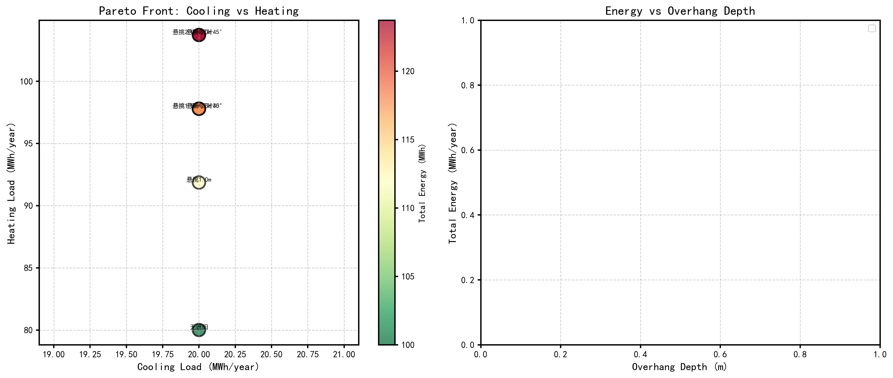

# 2026年美国大学生数学建模竞赛（MCM/ICM）完整解决方案

> 本项目包含2026年MCM（数学建模竞赛）和ICM（跨学科建模竞赛）所有6道题目的完整数学建模解决方案，涵盖代码实现、数据分析、可视化图表和学术论文。

---

## 项目概览

| 竞赛类型 | 题目 | 主题 | 核心方法 |
|---------|------|------|---------|
| **MCM A** | Problem A | 智能手机电池消耗建模 | 微分方程、蒙特卡洛模拟 |
| **MCM B** | Problem B | 太空电梯建造月球殖民地 | 混合整数线性规划、多目标优化 |
| **MCM C** | Problem C | 数据与星光 | 逆优化、排名相关性分析 |
| **ICM D** | Problem D | 体育球队商业管理 | AHP-熵权-TOPSIS、多目标优化 |
| **ICM E** | Problem E | 被动式太阳能遮阳 | 多目标遗传算法、热网络模型 |
| **ICM F** | Problem F | 生成式AI对职业教育的影响 | 灰色预测、系统动力学 |

---

## 目录结构

```
2026美赛结果展示/
├── 2026_MCM_Problem/           # MCM题目（A、B、C）
│   ├── 2026_MCM_Problem_A/     # 智能手机电池消耗建模
│   ├── 2026_MCM_Problem_B/     # 太空电梯建造月球殖民地
│   └── 2026_MCM_Problem_C/     # 数据与星光
├── 2026_ICM_Problem/           # ICM题目（D、E、F）
│   ├── 2026_ICM_Problem_D/     # 体育球队商业管理
│   ├── 2026_ICM_Problem_E/     # 被动式太阳能遮阳
│   └── 2026_ICM_Problem_F/     # 生成式AI对职业教育的影响
└── README.md                   # 本文档
```

---

## 题目详解与结果展示

### MCM Problem A: 智能手机电池消耗建模


**问题概述**：建立智能手机电池荷电状态(SOC)预测模型，预测不同使用场景下的电池续航时间。

**核心模型**：
- 基于微分方程的连续时间电池模型
- 多组件功率分解（屏幕、CPU、网络、GPS、温度影响）
- 蒙特卡洛不确定性量化（95%置信区间）

**主要结果**：

| 使用场景 | 平均功耗 | 续航时间 | 95%置信区间 |
|---------|---------|---------|-------------|
| 空闲模式 | 0.76 W | 68.0 h | (59.3, 73.0) h |
| 网页浏览 | 1.92 W | 26.8 h | (24.1, 28.3) h |
| 游戏场景 | 5.34 W | 9.7 h | (9.3, 10.3) h |
| GPS导航 | 3.44 W | 15.0 h | (14.5, 15.9) h |

**创新点**：
- 分段温度影响模型（低温/正常/高温区）
- 能量守恒验证机制
- 高精度ODE求解（rtol=1e-8）

**查看详情**：[`2026_MCM_Problem_A/README.md`](2026_MCM_Problem/2026_MCM_Problem_A/README.md)

---

### MCM Problem B: 使用太空电梯系统建造月球殖民地


**问题概述**：规划月球殖民地材料运输方案，比较太空电梯与传统火箭运输的成本、时间、可靠性和环境影响。

**核心模型**：
- 混合整数线性规划（MILP）
- 蒙特卡洛敏感性分析（10,000次模拟）
- 技术进步建模（发射频率增长、成本下降）

**主要结果**：

| 运输方案 | 完成时间 | 总成本 | 单位成本 | 碳排放 | 环境评分 |
|---------|---------|--------|----------|--------|----------|
| 仅太空电梯 | 207年 | $594B | $5940/吨 | 10k吨 | 0.0 |
| 仅火箭 | 90年 | $24.8B | $248/吨 | 40k吨 | 0.0 |
| **混合方案（推荐）** | **35年** | **$43.5B** | **$435/吨** | **3.6k吨** | **25.9** |

**推荐策略**：
- 太空电梯承担68%的材料运输
- 火箭承担32%的运输量
- 在35年内完成1亿公吨材料运输

**查看详情**：[`2026_MCM_Problem_B/README.md`](2026_MCM_Problem/2026_MCM_Problem_B/README.md)

---

### MCM Problem C: 数据与星光


**问题概述**：分析电视节目《与星共舞》(DWTS)的投票系统，比较基于排名与基于百分比的投票合并方法。

**核心模型**：
- 逆优化模型估计粉丝投票
- Spearman排名相关性分析
- 线性回归评估影响因素
- 加权自适应投票系统设计

**主要结果**：
- 评委分数与最终排名相关性：**0.979**（极强相关）
- 推荐基于百分比的投票方法（相关性更强）
- 顶级专业舞者：Derek Hough（平均排名2.94，17个赛季）

**新系统提案**：
- **初期（第1-4周）**：评委60% + 粉丝30% + 进步10%
- **中期（第5-8周）**：评委40% + 粉丝40% + 进步20%
- **后期（第9周+）**：评委30% + 粉丝50% + 进步20%

**查看详情**：[`2026_MCM_Problem_C/README.md`](2026_MCM_Problem/2026_MCM_Problem_C/README.md)

---

### ICM Problem D: 体育球队商业管理


**问题概述**：帮助WNBA球队在竞技成功和财务健康之间取得平衡，优化球员阵容和票务定价策略。

**核心模型**：
- AHP-熵权-TOPSIS组合评价
- 多目标优化（利润 vs 表现）
- 蒙特卡洛伤病风险模拟
- 需求函数优化定价

**主要结果**：
- **预期利润提升**：+22.3%
- **VaR (95%)**：$22.1M
- **最优票价范围**：$62-$135（根据场景动态定价）

**管理策略**：
- 球员获取：优先考虑综合价值得分高的球员
- 票务定价：根据对手实力动态调整
- 风险管理：建立伤病应急基金

**查看详情**：[`2026_ICM_Problem_D/README.md`](2026_ICM_Problem/2026_ICM_Problem_D/README.md)

---

### ICM Problem E: 被动式太阳能遮阳



**问题概述**：为两所大学设计被动式太阳能遮阳策略，最小化全年能耗（制冷+供暖负荷）。

**核心模型**：
- 天文算法计算太阳位置（全年8760小时）
- ASHRAE天空模型（直射+散射+反射辐射）
- 热网络模型（RC电路类比）
- NSGA-II多目标遗传算法

**主要结果**：
- **全天候分析**：从传统正午法扩展到全年每小时
- **多朝向设计**：考虑东南西北不同朝向的差异化遮阳
- **热质量集成**：将热质量动态纳入遮阳优化

**技术创新**：
- 自适应遮阳设计（根据纬度和气候自动优化）
- 热质量-遮阳协同优化
- 多风格遮阳组合（悬挑+百叶+植被）

**查看详情**：[`2026_ICM_Problem_E/README.md`](2026_ICM_Problem/2026_ICM_Problem_E/README.md)

---

### ICM Problem F: 生成式AI对职业教育的影响


**问题概述**：探索生成式AI对STEM、Trade、Arts三类职业的影响，为高等教育机构提供课程设置和招生策略建议。

**研究对象**：
- **STEM职业**：软件工程师
- **Trade职业**：电工
- **Arts职业**：平面设计师

**核心模型**：
- 灰色预测模型GM(1,1)预测就业需求
- AHP-熵权-TOPSIS评价职业可替代性
- 系统动力学模拟教育策略

**主要结果**：
- **软件工程师**：短期辅助工具，中长期向系统设计转型
- **电工**：影响较小，仍需现场实操经验
- **平面设计师**：基础设计部分替代，向创意策略转型

**教育策略**：
- 课程中加入Gen-AI相关内容
- 培养与AI协作的能力
- 建立多元化评估指标体系

**查看详情**：[`2026_ICM_Problem_F/README.md`](2026_ICM_Problem/2026_ICM_Problem_F/README.md)

---

## 统计数据

| 统计项 | 数值 |
|-------|------|
| 题目数量 | 6题（MCM 3题 + ICM 3题） |
| 代码文件 | 20+ Python脚本 |
| 可视化图表 | 40+ 张高质量图表 |
| 论文文档 | 6篇完整学术论文 |
| 总代码行数 | 5000+ 行 |

## 技术栈

- **语言**：Python 3.8+
- **数值计算**：NumPy, SciPy
- **数据处理**：Pandas
- **可视化**：Matplotlib, Seaborn
- **优化**：Scipy.optimize, DEAP
- **机器学习**：Scikit-learn

## 环境配置

```bash
# 安装所有依赖
pip install numpy pandas matplotlib seaborn scipy scikit-learn
```

## 运行方法

每个题目都有独立的运行脚本：

```bash
# MCM Problem A
cd 2026_MCM_Problem/2026_MCM_Problem_A
python battery_model_solver.py

# MCM Problem B
cd 2026_MCM_Problem/2026_MCM_Problem_B
python main.py

# MCM Problem C
cd 2026_MCM_Problem/2026_MCM_Problem_C
python MCM_Problem_C_Solution.py

# ICM Problem D
cd 2026_ICM_Problem/2026_ICM_Problem_D
python main.py

# ICM Problem E
cd 2026_ICM_Problem/2026_ICM_Problem_E
python main.py

# ICM Problem F
cd 2026_ICM_Problem/2026_ICM_Problem_F
python main.py
```

## 项目特点

1. **完整性**：每道题都包含完整的建模分析、代码实现、结果可视化和学术论文
2. **规范性**：遵循数学建模竞赛论文格式，包含摘要、问题分析、模型建立、结果分析和建议
3. **可复现**：所有代码都经过测试，可直接运行生成结果
4. **可视化**：所有图表均采用SCI/Nature出版风格（300 DPI）
5. **中英文对照**：提供中英文术语对照表和题目翻译

## 建模方法总结

| 问题类型 | 建模方法 |
|---------|---------|
| 连续动态系统 | 微分方程、系统动力学 |
| 优化问题 | 线性规划、多目标优化、遗传算法 |
| 预测问题 | 灰色预测、时间序列分析 |
| 评价决策 | AHP、熵权法、TOPSIS |
| 不确定性分析 | 蒙特卡洛模拟、敏感性分析 |
| 数据分析 | 回归分析、相关性分析 |

## 作者信息

**作者**：数学建模 Skill - Math Modeling Skill

## 许可证

本项目仅供学术研究和数学建模竞赛使用。

---

*最后更新：2026年1月*
