# Math Modeling Skill

<div align="center">

**为数学建模竞赛和项目提供的结构化三阶段工作流程**

[](https://claude.com/claude-code)
[](LICENSE)

</div>

---

## 简介

本技能为数学建模竞赛（CUMCM、MCM/ICM等）提供**建模分析 → 代码实现 → 论文撰写**三阶段协作工作流程，确保建模、编程、论文撰写三个环节紧密衔接，产出高质量的数学建模成果。

## 💡 创新指南

本技能鼓励创新和灵活性：

### 算法组合

- 可组合多个算法：如"灰色预测+神经网络"
- 参考不同类别的算法：如图论算法用于优化

### 题目特殊分析

- 当常规方法不适用时，灵活调整
- 分析题目独特性，选择或设计专门方法

### 创新记录

- 在分析文档中说明选择理由
- 在论文中突出创新点

## 特性

- **三阶段协作**：建模分析、代码实现、论文撰写，各司其职
- **算法资源库**：涵盖优化、预测、评价、图论、统计、综合、机器学习7大类60+算法
- **代码模板**：Python/MATLAB 双语言支持，符合 SCI/Nature 可视化标准
- **论文规范**：默认模板 + 自定义模板支持，符合竞赛格式要求
- **附录分析工具**：自动分析题目附录中的表格数据

## 工作流程

```mermaid
flowchart LR
    %% 建模分析阶段
    subgraph Modeling[建模分析 建模手]
        A[阅读题目] --> B[问题分析]
        B --> C[选择算法模型]
        C --> D[算法设计]
        D --> E[术语规范]
        E --> F[分析报告]
        E --> G[术语表格]
    end

    %% 代码实现阶段
    subgraph Coding[代码实现 编程手]
        H[理解需求] --> I[代码设计]
        I --> J[编写代码]
        J --> K[运行求解]
        K --> L[结果验证]
        L --> M[数据可视化]
        M --> N[结果输出]
        N --> O[README文档]
    end

    %% 论文撰写阶段
    subgraph Writing[论文撰写 论文手]
        P[收集资料] --> Q[论文规划]
        Q --> R[撰写论文]
        R --> S[完整论文]
    end

    %% 阶段连接
    F --> H
    G --> H
    N --> P
    O --> P

    %% 样式
    style Modeling fill:#e1f5ff,stroke:#0288d1
    style Coding fill:#fff4e1,stroke:#f57c00
    style Writing fill:#ffe1f5,stroke:#c2185b
```



### 各阶段详细任务

|        阶段        | 任务                                                         | 产出                        |
| :----------------: | ------------------------------------------------------------ | --------------------------- |
| **建模分析** | 题目分析、模型选择、算法设计、术语规范                       | 分析报告 + 术语表           |
| **代码实现** | 代码编写、结果求解、结果验证、迭代改进、数据可视化、文档说明 | 代码 + 结果 + 图表 + README |
| **论文撰写** | 资料收集、论文规划、内容撰写                                 | 完整论文（≥15000字）       |

### 三角色介绍

本技能采用**三角色协作模式**，每个角色对应一个工作阶段：

| 角色 | 对应阶段 | 定位 | 核心能力 |
|:----:|:--------:|------|---------|
| **建模手** | 建模分析 | 大脑 | 数学建模、算法设计 |
| **编程手** | 代码实现 | 双手 | 代码实现、数据可视化 |
| **论文手** | 论文撰写 | 喉舌 | 学术写作、成果整理 |

**📘 建模手** - 团队的大脑

建模手负责将实际问题转化为数学模型，是整个建模过程的起点。主要工作包括：深入理解题目背景、判断问题类型、选择合适的数学模型和算法、设计求解思路、建立术语规范确保全文一致性。

**💻 编程手** - 团队的双手

编程手负责将建模手的理论设计转化为可运行的代码。主要工作包括：严格按照建模分析的思路编写代码、求解问题并验证结果、生成符合 SCI/Nature 标准的可视化图表、撰写项目说明文档。

**📝 论文手** - 团队的发言人

论文手负责将前两个阶段的工作成果整理成规范的学术论文。主要工作包括：收集分析建模文档和代码结果、规划论文章节结构、撰写符合竞赛规范的完整论文（≥15000字）、确保图表引用正确、格式规范。

## 快速开始

### 安装

**Windows 安装路径**：

```bash
# 将 skill 文件夹复制到以下路径
C:/Users/<用户名>/.claude/skills/math-modeling-skill/
```

**macOS/Linux 安装路径**：

```bash
# 将 skill 文件夹复制到以下路径
~/.claude/skills/math-modeling-skill/
```

### 使用

安装后，直接向 Claude 提出数学建模相关需求：

```
用户: "帮我做这道数学建模题"

Claude:
1. 📋 建模分析：分析题目，选择模型
2. 💻 代码实现：编写代码，求解结果
3. 📝 论文撰写：撰写完整论文
```

> **⚠️ 重要提示**
>
> AI 生成的论文具有明显的"AI 味道"，容易被检测工具识别为 AI 生成内容。**请勿直接使用 AI 生成的全文**，建议：
>
> - 将 AI 生成的内容作为参考和框架
> - 结合自己的理解和分析进行修改润色
> - 添加个人见解和创新点
> - 调整表述风格，使其更符合个人写作习惯

## 目录结构

```
math-modeling-skill/
├── SKILL.md                    # 技能主文档
├── README.md                   # 本文件
├── assets/                     # 算法资源库
│   ├── README.md              # 算法快速索引
│   ├── 01-优化算法说明.md
│   ├── 02-预测类算法说明.md
│   ├── 03-评价类算法说明.md
│   ├── 04-图论与网络分析算法说明.md
│   ├── 05-统计分析与数据处理算法说明.md
│   ├── 06-综合类算法说明.md
│   └── 07-机器学习算法说明.md
├── references/                  # 各阶段说明文档
│   ├── 建模手说明.md           # 建模分析阶段工作细则
│   ├── 编程手说明.md           # 代码实现阶段工作细则
│   ├── 论文手说明.md           # 论文撰写阶段工作细则
│   ├── 默认论文模板.md         # 标准论文模板
│   └── README.md              # 三角色工作指南
└── scripts/                    # 工具脚本
    └── analyze_appendix.py     # 附录表格分析工具
```

## 算法覆盖

| 类别     | 算法数量 | 代表算法                                                             |
| -------- | -------- | -------------------------------------------------------------------- |
| 优化算法 | 15       | 线性规划、遗传算法、PSO、模拟退火、鲸鱼优化、麻雀搜索、多目标优化    |
| 预测算法 | 11       | 灰色预测、ARIMA、神经网络、Prophet、LSTM、XGBoost/LightGBM、时空预测 |
| 评价算法 | 11       | AHP、TOPSIS、熵权法、灰色关联、DEA、区间数评价、改进TOPSIS           |
| 图论网络 | 6        | 最短路径、最大流、MST、匹配问题                                      |
| 统计分析 | 9        | K-Means、层次聚类、DBSCAN、SOM、GMM、PCA、因子分析、CCA、NMF         |
| 综合算法 | 6        | 蒙特卡洛、排队论、博弈论、马尔科夫链、微分方程                       |
| 机器学习 | 3        | 随机森林、AdaBoost、孤立森林                                         |

## 适用竞赛

- 全国大学生数学建模竞赛 (CUMCM)
- 美国大学生数学建模竞赛 (MCM/ICM)
- 研究生数学建模竞赛
- 其他数学建模竞赛和项目

## 许可证

MIT License

---

<div align="center">

**[算法资源库](assets/README.md)** · **[使用文档](SKILL.md)** · **[角色说明](references/)**

</div>
