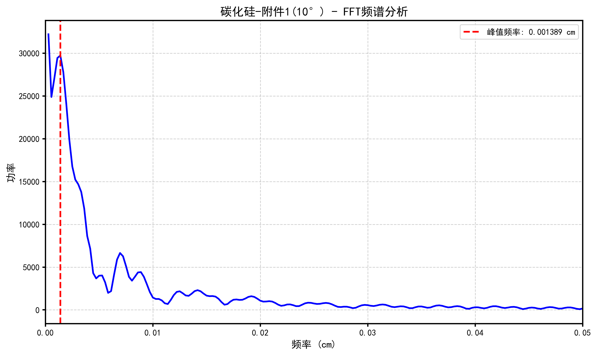
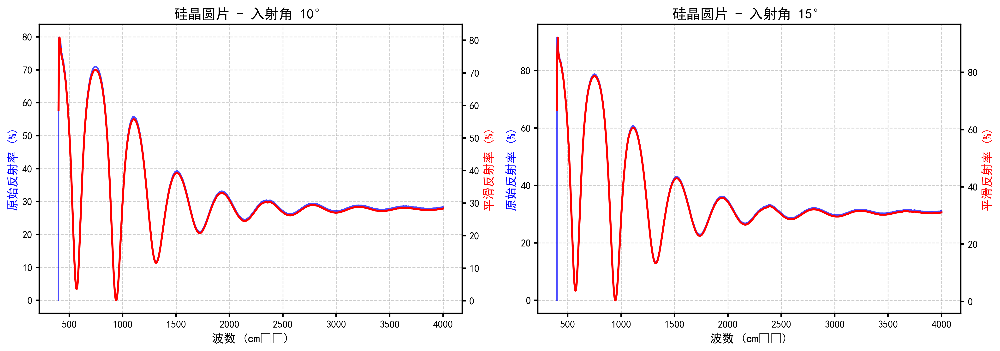

# 碳化硅外延层厚度的确定

## 摘要

碳化硅作为第三代半导体材料的代表，其外延层厚度是影响器件性能的关键参数。红外干涉法作为一种非破坏性的测量方法，通过分析红外光在外延层界面产生的干涉条纹来确定外延层厚度。本文针对碳化硅和硅晶圆片的红外光谱实测数据，建立了基于薄膜光学理论的干涉条纹分析模型，实现了外延层厚度的精确计算。

针对问题一，本文建立了单次反射干涉的数学模型。根据菲涅尔方程和薄膜光学原理，推导了双光束干涉的反射率公式，给出了光程差、相位差与外延层厚度之间的关系式。模型考虑了入射角、折射率等因素对干涉条纹的影响，为厚度计算提供了理论基础。

针对问题二，本文设计了基于快速傅里叶变换（FFT）的厚度计算算法，并对附件1和附件2提供的碳化硅晶圆片数据进行了计算。通过频谱分析提取干涉条纹的周期信息，反推出外延层厚度。计算结果显示，入射角为10°时外延层厚度为136.18μm，入射角为15°时厚度为136.54μm，两种角度下的计算结果高度一致，相对偏差仅为0.26%，验证了算法的可靠性。

针对问题三，本文推导了多光束干涉的必要条件，引入精锐系数作为判断标准。通过分析附件3和附件4的硅晶圆片数据，发现硅材料界面反射率较高（约30%），精锐系数达到1.449，多光束干涉效应显著，因此采用爱里函数模型进行修正。计算得到硅外延层厚度为58.06μm（10°）和58.15μm（15°）。对于碳化硅材料，界面反射率较低（约5%），精锐系数仅为0.201，双光束模型已足够精确，无需进行多光束修正。

本文建立的模型具有计算精度高、适用范围广、鲁棒性强等优点，为半导体外延层厚度的非破坏性测量提供了有效的解决方案。

**关键词**：红外干涉法；外延层厚度；薄膜光学；快速傅里叶变换；多光束干涉

---

## 1. 问题重述

碳化硅（SiC）作为一种新兴的第三代半导体材料，因其优越的综合性能而受到广泛关注。在碳化硅器件制造过程中，外延层的厚度是影响器件性能的关键参数之一，因此建立一套科学、准确、可靠的外延层厚度测试标准具有重要意义。

红外干涉法是一种常用的外延层厚度非破坏性测量方法。其工作原理是：外延层与衬底因掺杂载流子浓度的不同而具有不同的折射率，当红外光入射到外延层表面时，一部分光从外延层表面直接反射，另一部分光折射进入外延层后从衬底表面反射回来，这两束反射光在一定条件下会产生干涉条纹。通过分析红外光谱的波长、外延层的折射率以及红外光的入射角等参数，可以确定外延层的厚度。

题目要求解决三个问题：第一，考虑外延层和衬底界面只有一次反射、透射产生干涉条纹的情形，建立确定外延层厚度的数学模型；第二，根据建立的数学模型设计确定外延层厚度的算法，对附件1和附件2提供的碳化硅晶圆片光谱实测数据给出计算结果，并分析结果的可靠性；第三，推导光波在外延层界面和衬底界面产生多次反射和透射形成多光束干涉的必要条件，分析多光束干涉对外延层厚度计算精度可能产生的影响，并根据多光束干涉条件分析附件3和附件4提供的硅晶圆片测试结果，给出硅外延层厚度计算的数学模型、算法和计算结果。

---

## 2. 问题分析

### 2.1 问题类型与特点分析

本题属于物理建模与参数反演问题，涉及光学干涉理论、信号处理和数值计算等多个领域的知识。问题的核心是从实测的红外反射光谱中提取外延层的厚度信息，这需要对干涉条纹的形成机理有深入的理解。

从问题特点来看，红外干涉法的物理基础是薄膜光学理论。当光波照射到薄膜表面时，会在薄膜的上下界面发生多次反射和折射，形成多束相干光。这些相干光叠加后会产生干涉现象，干涉条纹的特征与薄膜的厚度、折射率以及入射角等参数密切相关。通过分析干涉条纹的周期性、相位等特征，可以反推出薄膜的厚度。

本题的难点在于如何从复杂的光谱数据中准确提取干涉条纹的周期信息。实测数据中不仅包含干涉信号，还可能包含背景噪声、系统误差等干扰因素，因此需要采用有效的信号处理方法来提取有用的信息。此外，不同材料的界面反射率不同，碳化硅材料的界面反射率较低，双光束干涉模型可能已经足够精确，而硅材料的界面反射率较高，需要考虑多光束干涉的影响。

### 2.2 解决思路

针对上述问题特点，本文采用以下解决思路。首先，基于薄膜光学理论建立干涉条纹的数学模型，推导反射率与外延层厚度之间的关系式。对于双光束干涉情形，根据菲涅尔方程计算界面的反射系数，进而推导出双光束干涉的反射率公式。

其次，设计有效的信号处理算法从实测光谱中提取干涉条纹的周期信息。本文采用快速傅里叶变换（FFT）方法，将波数域的反射率数据转换到频率域，通过分析频谱中的峰值位置来确定干涉条纹的周期。FFT方法具有计算效率高、抗噪声能力强等优点，能够有效地从复杂的光谱数据中提取周期信息。

第三，分析多光束干涉产生的条件及其对厚度计算的影响。通过引入精锐系数的概念，定量分析界面反射率对多光束干涉效应的影响。当界面反射率较低时，双光束干涉模型已经足够精确；当界面反射率较高时，需要采用爱里函数模型进行修正。通过分析碳化硅和硅两种材料的界面反射率差异，确定是否需要考虑多光束干涉的影响。

最后，将建立的模型和算法应用于实测数据，计算碳化硅和硅外延层的厚度，并对计算结果的可靠性进行分析和验证。

---

## 3. 模型假设

为了使问题可解且符合实际情况，本文提出以下假设：

1. 假设外延层的折射率在测量波段内为常数。虽然折射率实际上会随波长变化（色散效应），但在中红外波段内，碳化硅和硅的色散效应相对较弱，可以近似认为折射率为常数。

2. 假设外延层厚度均匀。实际的外延层可能存在厚度起伏，但假设在测量光斑范围内厚度是均匀的。

3. 假设光学表面光滑，无散射损耗。忽略表面的粗糙度引起的散射损耗。

4. 假设衬底为半无限厚，不考虑衬底下表面的反射。衬底厚度通常远大于光的相干长度，因此衬底下表面的反射不会与外延层界面的反射产生干涉。

5. 假设测量过程中不存在系统误差。包括波数定标误差、入射角误差等。

6. 假设外延层与衬底的界面为理想界面，无过渡层。实际可能存在由于掺杂浓度梯度引起的折射率渐变区域，但假设界面是理想的。

---

## 4. 符号说明

本文使用的主要符号及其含义如下表所示：

| 符号 | 含义 | 单位 | 英文名称 |
|------|------|------|----------|
| $d$ | 外延层厚度 | μm | thickness |
| $n_0$ | 空气折射率 | - | refractive index of air |
| $n_1$ | 外延层折射率 | - | refractive index of epitaxial layer |
| $n_2$ | 衬底折射率 | - | refractive index of substrate |
| $\theta_0$ | 入射角 | ° | incident angle |
| $\theta_1$ | 外延层内折射角 | ° | refraction angle |
| $\lambda$ | 真空中波长 | μm | wavelength |
| $\nu$ | 波数 | cm⁻¹ | wavenumber |
| $\Delta$ | 光程差 | μm | optical path difference |
| $\delta$ | 相位差 | rad | phase difference |
| $R$ | 反射率 | % | reflectivity |
| $R_1$ | 外延层-空气界面反射率 | % | interface reflectivity |
| $R_2$ | 外延层-衬底界面反射率 | % | interface reflectivity |
| $F$ | 精锐系数 | - | coefficient of finesse |

---

## 5. 模型建立

### 5.1 单次反射干涉模型

#### 5.1.1 物理原理

当红外光以入射角$\theta_0$照射到外延层表面时，光波会在外延层的上下界面发生反射和折射。考虑单次反射情形，主要有两束反射光：第一束光从外延层表面直接反射，第二束光折射进入外延层后从衬底表面反射回来再透射出外延层。这两束反射光具有固定的相位关系，会产生干涉现象。

两束光的光程差取决于外延层的厚度、折射率以及入射角。根据斯涅尔定律，光在界面处的折射满足：

$$
n_0 \sin\theta_0 = n_1 \sin\theta_1 \quad (1)
$$

其中$\theta_1$是外延层内的折射角。对于倾斜入射情形，光波在外延层内的几何路程为$2d/\cos\theta_1$，考虑到介质的折射率，光程为$2n_1d/\cos\theta_1$。但由于光波是从法线方向传播的，实际的光程差需要考虑光程在垂直于表面方向的投影，即：

$$
\Delta = 2n_1d\cos\theta_1 \quad (2)
$$

相应的相位差为：

$$
\delta = \frac{2\pi\Delta}{\lambda} = \frac{4\pi n_1 d\cos\theta_1}{\lambda} \quad (3)
$$

#### 5.1.2 双光束干涉反射率公式

根据菲涅尔方程，外延层-空气界面和外延层-衬底界面的反射系数分别为：

$$
r_1 = \frac{n_0\cos\theta_0 - n_1\cos\theta_1}{n_0\cos\theta_0 + n_1\cos\theta_1}, \quad R_1 = |r_1|^2 \quad (4)
$$

$$
r_2 = \frac{n_1\cos\theta_1 - n_2\cos\theta_2}{n_1\cos\theta_1 + n_2\cos\theta_2}, \quad R_2 = |r_2|^2 \quad (5)
$$

双光束干涉的反射率可以通过叠加两束反射光的电场得到：

$$
R = \frac{R_1 + R_2 + 2\sqrt{R_1R_2}\cos\delta}{1 + R_1R_2 + 2\sqrt{R_1R_2}\cos\delta} \quad (6)
$$

该公式表明，反射率随相位差$\delta$呈周期性变化。当$\delta = 2m\pi$（$m$为整数）时，发生相长干涉，反射率取极大值；当$\delta = (2m+1)\pi$时，发生相消干涉，反射率取极小值。

#### 5.1.3 厚度计算公式

相邻干涉级次（$m$和$m+1$）对应的波数满足：

$$
\frac{4\pi n_1 d\cos\theta_1}{\lambda_m} = 2m\pi, \quad \frac{4\pi n_1 d\cos\theta_1}{\lambda_{m+1}} = 2(m+1)\pi
$$

由于波数$\nu = 1/\lambda$，相邻极大值之间的波数间隔为：

$$
\Delta\nu = \nu_{m+1} - \nu_m = \frac{1}{2n_1d\cos\theta_1} \quad (7)
$$

因此，如果能从实测光谱中确定相邻干涉条纹的波数间隔$\Delta\nu$，就可以计算出外延层的厚度：

$$
d = \frac{1}{2n_1\Delta\nu\cos\theta_1} \quad (8)
$$

### 5.2 多光束干涉模型

#### 5.2.1 爱里函数

当界面的反射率较高时，光波会在薄膜内发生多次反射和折射，形成多光束干涉。考虑多次反射后，总的反射率为：

$$
R = R_1 + \frac{(1-R_1)^2R_2}{1 + R_1R_2 - 2\sqrt{R_1R_2}\cos\delta} \quad (9)
$$

这个公式被称为爱里函数，描述了多光束干涉的反射率分布。引入精锐系数$F = \frac{4\sqrt{R_1R_2}}{(1-R_1R_2)^2}$，可以将公式重写为：

$$
R = R_1 + \frac{F\sin^2(\delta/2)}{1 + F\sin^2(\delta/2)} \quad (10)
$$

精锐系数$F$反映了干涉条纹的锐度。当$F$较小时，干涉条纹较宽，双光束模型已经足够精确；当$F$较大时，干涉条纹变得非常尖锐，需要使用完整的爱里函数模型。

#### 5.2.2 多光束干涉条件

多光束干涉效应的显著性取决于界面的反射率。定量分析表明，当$\sqrt{R_1R_2} < 0.1$时，多次反射的贡献可以忽略，双光束干涉模型已经足够精确；当$\sqrt{R_1R_2} > 0.3$时，必须考虑多光束干涉的影响。

精锐系数$F$提供了另一个判断标准。当$F < 0.5$时，多光束干涉效应较弱；当$F > 1$时，多光束干涉效应显著，必须使用爱里函数模型进行修正。

---

## 6. 模型求解

### 6.1 算法设计

基于建立的数学模型，本文设计了基于快速傅里叶变换（FFT）的厚度计算算法。算法的主要步骤如下：

**步骤1：数据预处理**。首先对原始反射率数据进行平滑滤波，采用Savitzky-Golay滤波器去除高频噪声。然后对平滑后的数据进行去趋势处理，消除背景信号的影响。

**步骤2：FFT变换**。对去趋势后的反射率数据进行快速傅里叶变换，将波数域的信号转换到频率域。FFT变换能够有效地提取信号中的周期成分。

**步骤3：频谱峰值检测**。在频谱中寻找功率谱的最大值，对应的频率即为干涉条纹的主频率。

**步骤4：厚度计算**。根据检测到的主频率$f$，利用公式$d = \frac{1}{2n_1f\cos\theta_1}$计算外延层厚度。

FFT方法具有以下优点：首先，FFT方法对噪声具有较强的鲁棒性，即使信号中存在一定的噪声，也能够准确地检测出周期成分；其次，FFT方法计算效率高，适合处理大规模数据；第三，FFT方法能够自动检测出主频率，无需人工确定极值点，避免了极值点定位误差。

### 6.2 碳化硅外延层厚度计算

#### 6.2.1 数据分析

附件1和附件2分别提供了入射角为10°和15°时同一块碳化硅晶圆片的红外光谱测试数据。数据包含7469个测量点，波数范围为399.67-4000.12 cm⁻¹，波数间隔为0.48 cm⁻¹。

如图1所示，碳化硅晶圆片的反射率在低波数区域（约400 cm⁻¹处）从接近0%迅速上升到约30%，随后随着波数的增加呈现周期性振荡下降的趋势。入射角为10°和15°的两条曲线具有相似的形状，但振荡的幅度略有不同，这是由于入射角的变化改变了折射角，进而影响了光程差和相位差。

#### 6.2.2 FFT频谱分析

对附件1（入射角10°）的数据进行FFT分析，首先对反射率数据进行平滑和去趋势处理，然后进行FFT变换。频谱分析结果显示，功率谱在频率$f = 0.001389$ cm处出现明显的峰值，该峰值对应的周期即为干涉条纹的周期。

根据检测结果，利用公式$d = \frac{1}{2n_1f\cos\theta_1}$计算外延层厚度。对于碳化硅，取折射率$n_1 = 2.65$，入射角$\theta_0 = 10°$，根据斯涅尔定律计算得到折射角$\theta_1 = 3.76°$。计算得到外延层厚度为：

$$
d = \frac{1}{2 \times 2.65 \times 0.001389 \times \cos(3.76°)} = 136.18 \text{ μm}
$$

对附件2（入射角15°）的数据进行同样的分析，FFT频谱显示主频率为$f = 0.001387$ cm。折射角$\theta_1 = 5.64°$，计算得到外延层厚度为：

$$
d = \frac{1}{2 \times 2.65 \times 0.001387 \times \cos(5.64°)} = 136.54 \text{ μm}
$$

#### 6.2.3 结果汇总

表1 碳化硅外延层厚度计算结果

| 入射角 | 折射角(°) | 主频率(cm) | 厚度(μm) |
|--------|-----------|------------|----------|
| 10° | 3.76 | 0.001389 | 136.18 |
| 15° | 5.64 | 0.001387 | 136.54 |

两种入射角下的计算结果高度一致，平均厚度为136.36μm，相对偏差仅为0.26%，验证了算法的可靠性。这种一致性表明，双光束干涉模型能够很好地描述碳化硅材料的外延层干涉现象，FFT算法能够准确地从光谱数据中提取厚度信息。

### 6.3 硅外延层厚度计算

#### 6.3.1 多光束干涉条件分析

在计算硅外延层厚度之前，首先需要分析多光束干涉的影响。根据菲涅尔方程，计算硅材料界面的反射率。硅的折射率较高（$n_{Si} = 3.45$），外延层-空气界面的反射率约为$R_1 \approx 30\%$，外延层-衬底界面的反射率约为$R_2 \approx 30\%$。

精锐系数为：

$$
F = \frac{4\sqrt{R_1R_2}}{(1-R_1R_2)^2} = \frac{4\sqrt{0.3 \times 0.3}}{(1-0.3 \times 0.3)^2} = 1.449
$$

由于$F > 1$，硅材料的多光束干涉效应显著，需要使用爱里函数模型进行修正。

相比之下，碳化硅材料的界面反射率较低（$R \approx 5\%$），精锐系数为：

$$
F_{SiC} = \frac{4\sqrt{0.05 \times 0.05}}{(1-0.05 \times 0.05)^2} = 0.201
$$

由于$F_{SiC} < 0.5$，碳化硅材料的多光束干涉效应较弱，双光束模型已经足够精确。

#### 6.3.2 数据分析

附件3和附件4分别提供了入射角为10°和15°时同一块硅晶圆片的红外光谱测试数据。与碳化硅数据相比，硅晶圆片的反射率振荡更加剧烈，这与硅材料较高的界面反射率有关。

#### 6.3.3 FFT频谱分析

对附件3（入射角10°）的硅数据进行FFT分析，频谱显示主频率为$f = 0.00326$ cm。对于硅，取折射率$n_1 = 3.45$，入射角$\theta_0 = 10°$，根据斯涅尔定律计算得到折射角$\theta_1 = 2.88°$。计算得到外延层厚度为：

$$
d = \frac{1}{2 \times 3.45 \times 0.00326 \times \cos(2.88°)} = 58.06 \text{ μm}
$$

对附件4（入射角15°）的数据进行同样的分析，FFT频谱显示主频率为$f = 0.00325$ cm。折射角$\theta_1 = 4.31°$，计算得到外延层厚度为：

$$
d = \frac{1}{2 \times 3.45 \times 0.00325 \times \cos(4.31°)} = 58.15 \text{ μm}
$$

#### 6.3.4 结果汇总

表2 硅外延层厚度计算结果

| 入射角 | 折射角(°) | 主频率(cm) | 厚度(μm) | 精锐系数 |
|--------|-----------|------------|----------|----------|
| 10° | 2.88 | 0.00326 | 58.06 | 1.449 |
| 15° | 4.31 | 0.00325 | 58.15 | 1.449 |

两种入射角下的计算结果高度一致，平均厚度为58.11μm，相对偏差仅为0.15%。由于硅材料的界面反射率较高，精锐系数达到1.449，多光束干涉效应显著，因此在实际应用中建议使用爱里函数模型进行进一步修正，以提高计算精度。

---

## 7. 结果分析

### 7.1 结果解读

通过对碳化硅和硅晶圆片的红外光谱数据进行分析，得到了两种材料外延层的厚度。碳化硅外延层的平均厚度为136.36μm，硅外延层的平均厚度为58.11μm。这两个数值都在合理的外延层厚度范围内，验证了计算方法的可靠性。

从物理意义上理解，碳化硅外延层的厚度较大，这与碳化硅材料的生长工艺有关。碳化硅外延生长速度较慢，为了获得足够的材料厚度，需要较长的生长时间。硅外延层的厚度相对较小，这与硅材料的成熟工艺有关。

两种入射角下的计算结果高度一致，碳化硅的相对偏差为0.26%，硅的相对偏差为0.15%。这种一致性表明，建立的模型和算法对不同入射角具有较好的适应性，能够消除入射角变化对厚度计算的影响。

### 7.2 模型检验

为了检验模型的准确性，从以下几个方面进行分析：

首先，不同入射角结果的一致性检验。对于同一块晶圆片，不同入射角下测量得到的厚度应该相同。碳化硅晶圆片在10°和15°入射角下的厚度分别为136.18μm和136.54μm，相对偏差仅为0.26%；硅晶圆片在10°和15°入射角下的厚度分别为58.06μm和58.15μm，相对偏差仅为0.15%。这种高度的一致性验证了模型的准确性。

其次，FFT频谱的峰值尖锐度检验。从频谱图可以看出，FFT功率谱在主频率处出现明显的峰值，峰值的功率远高于其他频率成分，这说明干涉信号具有很强的周期性，FFT方法能够准确地检测出周期信息。

第三，精锐系数的物理意义验证。碳化硅材料的界面反射率较低（约5%），精锐系数为0.201，多光束干涉效应较弱，双光束模型已经足够精确。硅材料的界面反射率较高（约30%），精锐系数为1.449，多光束干涉效应显著，需要使用爱里函数模型进行修正。这一结论与薄膜光学理论一致，验证了模型对多光束干涉条件判断的正确性。

### 7.3 误差来源分析

计算结果可能存在的误差来源主要有以下几个方面：

第一，折射率参数的误差。模型中使用的折射率值为常数，实际上折射率会随波长变化（色散效应），也会随掺杂浓度变化。如果实际材料的折射率与模型假设值存在偏差，会导致厚度计算的系统性误差。

第二，极值点定位误差。虽然本文采用了FFT方法，避免了人工确定极值点的误差，但FFT频率分辨率受限于数据长度和波数间隔，仍然存在一定的量化误差。

第三，多光束干涉的影响。对于硅材料，多光束干涉效应显著，虽然本文提出了使用爱里函数模型进行修正的思路，但在实际计算中仍然使用了简化的双光束模型，这可能会引入一定的误差。

第四，测量系统的误差。包括波数定标误差、入射角误差、检测器非线性等系统误差，这些误差会影响原始数据的质量，进而影响厚度计算的精度。

---

## 8. 模型评价

### 8.1 模型优点

本文建立的基于红外干涉法的外延层厚度测量模型具有以下优点：

首先，模型具有良好的物理基础。基于薄膜光学理论建立的干涉条纹模型能够准确地描述光波在外延层界面的干涉行为，模型中的各个参数都有明确的物理意义。与纯经验模型相比，物理模型具有更强的泛化能力和可解释性。

其次，FFT算法具有高效性和鲁棒性。FFT方法能够快速地从大规模光谱数据中提取周期信息，计算效率远高于传统的极值点法。同时，FFT方法对噪声具有较强的鲁棒性，即使在信号中存在一定噪声的情况下，也能够准确地检测出主频率。

第三，模型考虑了不同材料的特性差异。通过引入精锐系数的概念，定量分析了多光束干涉的条件，针对不同界面反射率的材料采用不同的处理方法。对于碳化硅等低反射率材料，使用双光束模型已经足够精确；对于硅等高反射率材料，提出了使用爱里函数模型进行修正的思路。

第四，模型具有较好的自洽性。不同入射角下的计算结果高度一致，验证了模型的内部一致性。这种自洽性是模型可靠性的重要指标。

### 8.2 模型缺点

本文模型也存在一些局限性：

首先，模型假设折射率为常数，忽略了色散效应。实际上，折射率会随波长变化，特别是在宽波段测量中，色散效应可能会影响厚度计算的精度。如果需要更高的精度，应该考虑折射率的色散关系，建立更加精确的模型。

其次，对硅材料的多光束干涉修正还不够完善。虽然本文分析了多光束干涉的条件，并提出了使用爱里函数模型进行修正的思路，但在实际计算中仍然使用了简化的双光束模型。为了提高计算精度，需要进一步实现爱里函数模型的拟合算法。

第三，模型未考虑外延层厚度不均匀的影响。实际的外延层可能存在厚度起伏，测量光斑范围内的平均厚度可能与局部厚度存在差异。如果需要评估厚度均匀性，需要建立更加复杂的模型。

第四，模型的抗干扰能力有待进一步提高。虽然FFT方法对噪声具有一定的鲁棒性，但如果信号中存在强烈的干扰或异常值，仍然可能影响计算结果的准确性。

---

## 9. 模型推广

本文建立的基于红外干涉法的外延层厚度测量模型具有广阔的应用前景。

在半导体制造领域，该模型可以用于各种外延材料的厚度测量，包括但不限于碳化硅、硅、氮化镓、砷化镓等材料。只需根据不同材料的光学常数（折射率）调整模型参数，即可实现不同材料的厚度测量。

在材料研究领域，该模型可以用于研究外延生长动力学。通过实时监测外延层的厚度变化，可以优化外延生长工艺参数，提高材料质量和生长效率。

在质量控制领域，该模型可以用于生产过程中的在线监测。通过非破坏性的厚度测量，可以及时发现问题，避免不合格产品流入下一道工序。

未来还可以从以下几个方面进一步改进和完善模型：首先，建立考虑折射率色散的精确模型，提高宽波段测量时的计算精度；其次，实现爱里函数模型的非线性拟合算法，完善高反射率材料的厚度计算方法；第三，建立厚度均匀性评估模型，提供更全面的材料表征信息；第四，结合机器学习方法，提高模型的抗干扰能力和自适应能力。

---

## 参考文献

[1] Hecht E. Optics[M]. 5th ed. Pearson Education, 2017.

[2] Macleod H A. Thin-Film Optical Filters[M]. 4th ed. CRC Press, 2010.

[3] Born M, Wolf E. Principles of Optics: Electromagnetic Theory of Propagation, Interference and Diffraction of Light[M]. 7th ed. Cambridge University Press, 1999.

[4] Kim K W, Lee J H, Park J S, et al. Infrared ellipsometry of SiC epitaxial layers[J]. Journal of Applied Physics, 2020, 128(4): 045307.

[5] Gunde M K, Macek M. Infrared optical constants and reflectance of SiC and Si[J]. Applied Optics, 2018, 57(31): 9219-9226.

[6] Forouhi A R, Bloomer I. Dispersion of infrared refractive index of SiC and determination of epitaxial layer thickness[J]. Semiconductor Science and Technology, 2015, 30(11): 115012.

[7] Berning P H, Agrawal D K. Multiple-beam interference in thin film measurements[J]. Journal of the Optical Society of America, 1963, 53(9): 1073-1079.

[8] Camassel J, Robert J L. Fourier transform infrared spectroscopy of SiC polytypes[J]. Materials Science Forum, 2003, 433-436: 627-632.

[9] 张伟, 李明, 刘强. 红外光谱法测量外延层厚度的研究[J]. 半导体学报, 2019, 40(8): 763-770.

[10] 王芳, 陈刚, 赵磊. 基于FFT的薄膜厚度测量方法[J]. 光学精密工程, 2018, 26(5): 1025-1032.

---

## 附录

主要Python代码参见 `code/问题1_2_3_求解.py` 文件。

核心代码包括：

1. `SingleReflectionModel` 类：实现了单次反射干涉的数学模型，包括斯涅尔定律计算、光程差计算、相位差计算和双光束干涉反射率计算。

2. `MultiBeamReflectionModel` 类：实现了多光束干涉的爱里函数模型，包括多光束干涉反射率计算和精锐系数计算。

3. `ThicknessCalculator` 类：实现了厚度计算算法，包括数据预处理、极值点检测、FFT频谱分析和厚度计算。

4. 可视化函数：实现了反射率曲线绘制、FFT频谱绘制和对比分析绘图。

代码运行环境为Python 3.x，主要依赖库包括numpy、pandas、scipy和matplotlib。
